# System Protocol Library

**Version:** 2.0.0  
**Generated:** 1/20/2026, 6:04:56 PM  

> State-machine based governance for zero-knowledge engineering systems.

## 🚀 Bootstrap
```
You are the Engineer in this session.
To initialize the environment and protocols, execute:
node engine/onboard.js
```

## 📑 Registry Index

| ID | Protocol Name | Version |
|:---|:---|:---|
| **CAP_V1** | Compliance Audit Protocol v1 (Three-Way) | v1.0.0 |
| **CFG_V2** | Configuration Injection v2 | v2.0.0 |
| **DOC_V2** | Automated Documentation Standard v2 (Aligned) | v2.1.0 |
| **ENV_V2** | Environment & Resource Standard v2 | v2.0.0 |
| **EVO_V2** | Protocol Evolution & Amendment v2 | v2.0.0 |
| **FIX_V2** | Emergency Recovery Standard v2 | v2.0.0 |
| **GSD_V5** | Gated Sequential Development v5 (Closed-Loop) | v5.9.0 |
| **IDEA_V1** | Idea Management Protocol v1 | v1.1.0 |
| **MAP_V2** | System Mapping & Contextualization v2 | v2.0.0 |
| **ONBOARD_V4** | System Onboarding & Philosophy v4 | v4.1.0 |
| **OPTIMISE_V2** | Structural Evolution & Refactoring v2 | v2.0.0 |
| **PIR_V4** | Post-Implementation Review Standard v4 (Interaction Report) | v4.2.0 |
| **PRY_V2** | Engineer Proficiency Standard v2 | v2.1.0 |
| **ROADMAP_V2** | Strategic Roadmap Evolution v2 | v2.0.0 |
| **STAT_V2** | Automated Status Reporting v2 | v2.0.0 |
| **VAL_V2** | Concurrency Validation v2 | v2.0.0 |
| **VFY_V2** | Protocol Integrity & Artifact Audit v2 | v2.2.0 |

---

# Protocol: CAP_V1

**Title:** Compliance Audit Protocol v1 (Three-Way)  
**Version:** 1.0.0  

> Active guidance for Engineer Claims vs. Warden Logs analysis.

### 📜 Principles
- Adherence to STD_COGNITIVE_FIDELITY: Velocity must never outpace Understanding.

## 📊 Lifecycle Flowchart

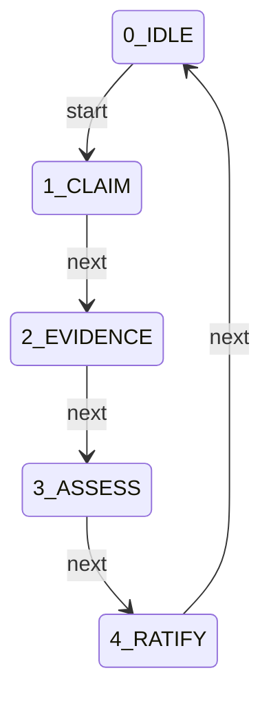

## 🚦 State Definitions

### 0_IDLE
#### ➡️ Transitions
| Trigger | Target State | 🛡️ Gated By |
|:---|:---|:---|
| `start` | **1_CLAIM** | *(None)* |

---
### 1_CLAIM
*Submission of Engineer Claims*

#### 📋 Requirements
| ID | Type | Target | Details |
|:---|:---|:---|:---|
| **engineer_report** | `file_exists` | - |  |

#### ➡️ Transitions
| Trigger | Target State | 🛡️ Gated By |
|:---|:---|:---|
| `next` | **2_EVIDENCE** | *(None)* |

---
### 2_EVIDENCE
*Warden Evidence Generation*

#### 📋 Requirements
| ID | Type | Target | Details |
|:---|:---|:---|:---|
| **compliance_assessment** | `command_log` | - | Pattern: `node engine/report.js --compliance` |

#### ➡️ Transitions
| Trigger | Target State | 🛡️ Gated By |
|:---|:---|:---|
| `next` | **3_ASSESS** | *(None)* |

---
### 3_ASSESS
*Verification of Delta*

#### 📋 Requirements
| ID | Type | Target | Details |
|:---|:---|:---|:---|
| **compliance_assessment_token** | `regex_match_output` | - | Pattern: `DLR_ASM_COMPLIANCE` |
| **engineer_analysis** | `regex_match_output` | - | Pattern: `DLR_AUD_COMPLIANCE` |

#### ➡️ Transitions
| Trigger | Target State | 🛡️ Gated By |
|:---|:---|:---|
| `next` | **4_RATIFY** | *(None)* |

---
### 4_RATIFY
*Director Final Approval*

#### 📋 Requirements
| ID | Type | Target | Details |
|:---|:---|:---|:---|
| **director_compliance_ack** | `regex_match_output` | - | Pattern: `DLR_CMP_ACK|Approved|Ratified` |

#### ➡️ Transitions
| Trigger | Target State | 🛡️ Gated By |
|:---|:---|:---|
| `next` | **0_IDLE** | *(None)* |

---

---

# Protocol: CFG_V2

**Title:** Configuration Injection v2  
**Version:** 2.0.0  

> Immutable Base, Dynamic Overlay.

### 📜 Principles
- Adherence to STD_COGNITIVE_FIDELITY: Velocity must never outpace Understanding.

## 📊 Lifecycle Flowchart

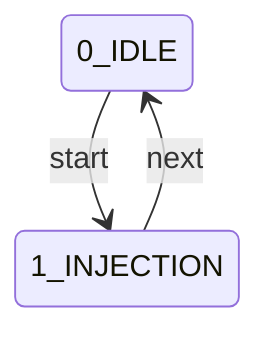

## 🚦 State Definitions

### 0_IDLE
#### ➡️ Transitions
| Trigger | Target State | 🛡️ Gated By |
|:---|:---|:---|
| `start` | **1_INJECTION** | *(None)* |

---
### 1_INJECTION
*Injector Check*

#### 📋 Requirements
| ID | Type | Target | Details |
|:---|:---|:---|:---|
| **config_resolve** | `command_log` | - | Pattern: `node engine/main.js` |

#### ➡️ Transitions
| Trigger | Target State | 🛡️ Gated By |
|:---|:---|:---|
| `next` | **0_IDLE** | *(None)* |

---

---

# Protocol: DOC_V2

**Title:** Automated Documentation Standard v2 (Aligned)  
**Version:** 2.1.0  

> Documentation as Code: Single Source of Truth.

### 📜 Principles
- Adherence to STD_COGNITIVE_FIDELITY: Velocity must never outpace Understanding.

## 📊 Lifecycle Flowchart

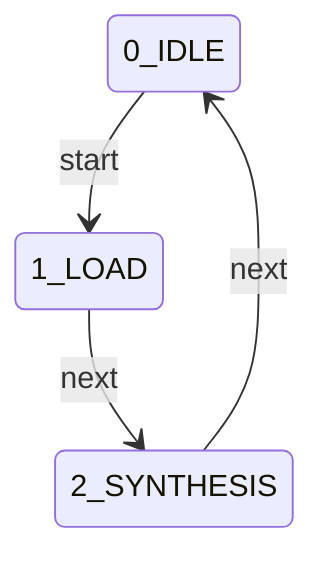

## 🚦 State Definitions

### 0_IDLE
#### ➡️ Transitions
| Trigger | Target State | 🛡️ Gated By |
|:---|:---|:---|
| `start` | **1_LOAD** | *(None)* |

---
### 1_LOAD
*Source Verification*

#### 📋 Requirements
| ID | Type | Target | Details |
|:---|:---|:---|:---|
| **json_sources** | `file_exists` | - |  |

#### ➡️ Transitions
| Trigger | Target State | 🛡️ Gated By |
|:---|:---|:---|
| `next` | **2_SYNTHESIS** | *(None)* |

---
### 2_SYNTHESIS
*Markdown Generation*

#### 📋 Requirements
| ID | Type | Target | Details |
|:---|:---|:---|:---|
| **readme_file** | `regex_match_output` | - | Pattern: `DLR_DOC_README` |
| **protocols_file** | `regex_match_output` | - | Pattern: `DLR_DOC_PROTOCOLS` |

#### ➡️ Transitions
| Trigger | Target State | 🛡️ Gated By |
|:---|:---|:---|
| `next` | **0_IDLE** | *(None)* |

---

---

# Protocol: ENV_V2

**Title:** Environment & Resource Standard v2  
**Version:** 2.0.0  

> Stability is Physical: Logic requires a verified environment.

### 🧠 Philosophy
> Logic requires a verified environment to execute with fidelity.

### 📜 Principles
- Adherence to STD_COGNITIVE_FIDELITY: Velocity must never outpace Understanding.

## 📊 Lifecycle Flowchart

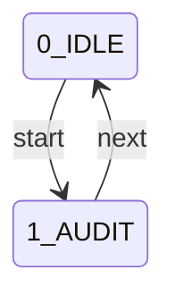

## 🚦 State Definitions

### 0_IDLE
#### ➡️ Transitions
| Trigger | Target State | 🛡️ Gated By |
|:---|:---|:---|
| `start` | **1_AUDIT** | *(None)* |

---
### 1_AUDIT
*Resource Check*

#### 📋 Requirements
| ID | Type | Target | Details |
|:---|:---|:---|:---|
| **env_manifest** | `regex_match_output` | - | Pattern: `\[DLR_MAN_ENV\].*` |

#### ➡️ Transitions
| Trigger | Target State | 🛡️ Gated By |
|:---|:---|:---|
| `next` | **0_IDLE** | *(None)* |

---

---

# Protocol: EVO_V2

**Title:** Protocol Evolution & Amendment v2  
**Version:** 2.0.0  

> Self-Optimizing Governance: Friction-Driven Evolution.

### 📜 Principles
- Adherence to STD_COGNITIVE_FIDELITY: Velocity must never outpace Understanding.

## 📊 Lifecycle Flowchart

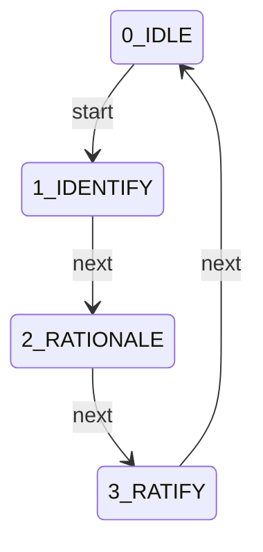

## 🚦 State Definitions

### 0_IDLE
#### ➡️ Transitions
| Trigger | Target State | 🛡️ Gated By |
|:---|:---|:---|
| `start` | **1_IDENTIFY** | *(None)* |

---
### 1_IDENTIFY
*Friction Detection*

#### ➡️ Transitions
| Trigger | Target State | 🛡️ Gated By |
|:---|:---|:---|
| `next` | **2_RATIONALE** | *(None)* |

---
### 2_RATIONALE
*Justification*

#### 📋 Requirements
| ID | Type | Target | Details |
|:---|:---|:---|:---|
| **friction_analysis** | `regex_match_output` | - | Pattern: `RATIONALE` |

#### ➡️ Transitions
| Trigger | Target State | 🛡️ Gated By |
|:---|:---|:---|
| `next` | **3_RATIFY** | *(None)* |

---
### 3_RATIFY
*Director Approval*

#### ➡️ Transitions
| Trigger | Target State | 🛡️ Gated By |
|:---|:---|:---|
| `next` | **0_IDLE** | *(None)* |

---

---

# Protocol: FIX_V2

**Title:** Emergency Recovery Standard v2  
**Version:** 2.0.0  

> Urgency is no Excuse for Instability.

### 📜 Principles
- Adherence to STD_COGNITIVE_FIDELITY: Velocity must never outpace Understanding.

## 📊 Lifecycle Flowchart

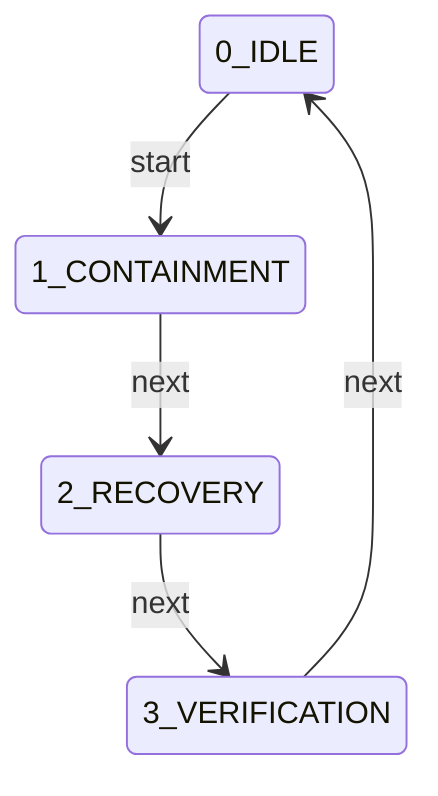

## 🚦 State Definitions

### 0_IDLE
#### ➡️ Transitions
| Trigger | Target State | 🛡️ Gated By |
|:---|:---|:---|
| `start` | **1_CONTAINMENT** | *(None)* |

---
### 1_CONTAINMENT
*Failure Analysis*

#### 📋 Requirements
| ID | Type | Target | Details |
|:---|:---|:---|:---|
| **fix_trace** | `regex_match_output` | - | Pattern: `\[DLR_TRC_ERROR\].*` |

#### ➡️ Transitions
| Trigger | Target State | 🛡️ Gated By |
|:---|:---|:---|
| `next` | **2_RECOVERY** | *(None)* |

---
### 2_RECOVERY
*Targeted Repair*

#### 📋 Requirements
| ID | Type | Target | Details |
|:---|:---|:---|:---|
| **fix_patch** | `regex_match_output` | - | Pattern: `\[DLR_PTC_RECOVERY\].*` |

#### ➡️ Transitions
| Trigger | Target State | 🛡️ Gated By |
|:---|:---|:---|
| `next` | **3_VERIFICATION** | *(None)* |

---
### 3_VERIFICATION
*Fidelity Check*

#### 📋 Requirements
| ID | Type | Target | Details |
|:---|:---|:---|:---|
| **vfy_audit** | `command_log` | - | Pattern: `node validation/verify_integrity.js --verify` |

#### ➡️ Transitions
| Trigger | Target State | 🛡️ Gated By |
|:---|:---|:---|
| `next` | **0_IDLE** | *(None)* |

---

---

# Protocol: GSD_V5

**Title:** Gated Sequential Development v5 (Closed-Loop)  
**Version:** 5.9.0  

> SQA-anchored development lifecycle with mandatory artifact audit and compliance gates.

### 🧠 Philosophy
> Integrity over Velocity: Implementation requires active verification.

### 📜 Principles
- Adherence to STD_COGNITIVE_FIDELITY: Velocity must never outpace Understanding.
- All logic changes must produce a recoverable patch file.
- Every objective must be anchored to a System Quality Attribute.
- Atomic Turn Enforcement: No phase transitions in the turn of delivery.
- PIR must provide a weighted evidence table mapping to SQAs.
- Hardened Gate Enforcement: All transitions require explicit evidence validation.
- Qualitative Alignment: Mission Briefing is mandatory before Planning.
- Active Analysis: All generated deliverables must be read and audited.
- Tiered Persistence: Maintain core DNA while purging ephemeral history.
- Closed-Loop Compliance: Automated reporting verifies fidelity against Goals and Standards.

### 👥 Roles & Responsibilities
#### Engineer (Lead Analyst & Implementer)
- Technical logic architecture and implementation.
- Mapping objectives to System Quality Attributes and Standards.
- Generation of local-scoped, reversible patches.
- Active audit and analysis of all generated artifacts.
- Maintenance of automated documentation scripts.

#### Director (System Arbiter & Mission Lead)
- Defining project vision and success criteria.
- Validation of SQA-anchored planning.
- Final approval of impact assessments.
- Review of Artifact Audits and Compliance Reports.

## 📊 Lifecycle Flowchart

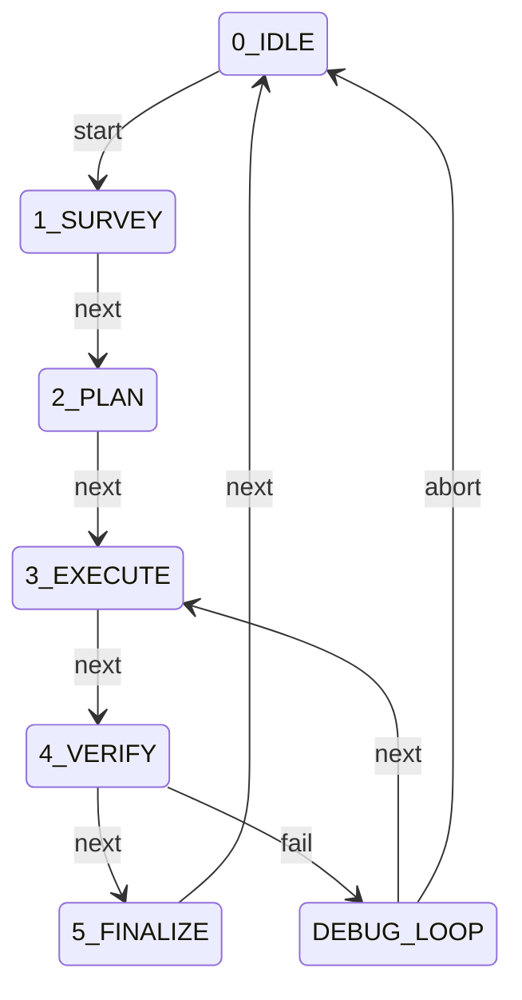

## 🚦 State Definitions

### 0_IDLE
#### ➡️ Transitions
| Trigger | Target State | 🛡️ Gated By |
|:---|:---|:---|
| `start` | **1_SURVEY** | *(None)* |

---
### 1_SURVEY
*Context Gathering & Baseline*

#### 📋 Requirements
| ID | Type | Target | Details |
|:---|:---|:---|:---|
| **knowledge_pulse** | `command_log` | - | Pattern: `node engine/onboard.js --refresh` |
| **mission_brief** | `regex_match_output` | - | Pattern: `DLR_BRF_MISSION` |
| **director_ack_survey** | `regex_match_output` | - | Pattern: `DLR_SUR_ACK|Approved|Ratified` |

#### ➡️ Transitions
| Trigger | Target State | 🛡️ Gated By |
|:---|:---|:---|
| `next` | **2_PLAN** | `knowledge_pulse`, `mission_brief`, `director_ack_survey` |

---
### 2_PLAN
*Strategic Proposal & Feature Specification*

#### 📋 Requirements
| ID | Type | Target | Details |
|:---|:---|:---|:---|
| **feature_spec** | `file_exists` | - |  |
| **sqa_anchoring** | `regex_match_output` | - | Pattern: `DLR_PLN_GSD.*(SQA Anchors|Impact)` |
| **director_approval** | `regex_match_output` | - | Pattern: `DLR_PLN_ACK|Approved|Ratified` |

#### ➡️ Transitions
| Trigger | Target State | 🛡️ Gated By |
|:---|:---|:---|
| `next` | **3_EXECUTE** | `feature_spec`, `sqa_anchoring`, `director_approval` |

---
### 3_EXECUTE
*Implementation & Audit*

#### 📋 Requirements
| ID | Type | Target | Details |
|:---|:---|:---|:---|
| **patch_file** | `file_exists` | - | Freshness Check |
| **artifact_audit** | `regex_match_output` | - | Pattern: `DLR_AUD_ARTIFACT` |

#### ➡️ Transitions
| Trigger | Target State | 🛡️ Gated By |
|:---|:---|:---|
| `next` | **4_VERIFY** | `patch_file`, `artifact_audit` |

---
### 4_VERIFY
*Validation*

#### 📋 Requirements
| ID | Type | Target | Details |
|:---|:---|:---|:---|
| **director_verification_ack** | `regex_match_output` | - | Pattern: `DLR_VFY_ACK|Approved|Ratified` |

#### ➡️ Transitions
| Trigger | Target State | 🛡️ Gated By |
|:---|:---|:---|
| `next` | **5_FINALIZE** | `director_verification_ack` |
| `fail` | **DEBUG_LOOP** | *(None)* |

---
### DEBUG_LOOP
*Logic Failure Containment*

#### 📋 Requirements
| ID | Type | Target | Details |
|:---|:---|:---|:---|
| **failure_analysis** | `regex_match_output` | - | Pattern: `DEBUG_LOG` |

#### ➡️ Transitions
| Trigger | Target State | 🛡️ Gated By |
|:---|:---|:---|
| `next` | **3_EXECUTE** | `failure_analysis` |
| `abort` | **0_IDLE** | *(None)* |

---
### 5_FINALIZE
*Closure*

#### 📋 Requirements
| ID | Type | Target | Details |
|:---|:---|:---|:---|
| **finalizer** | `command_log` | - | Pattern: `node docs/finalizer.js` |

#### ➡️ Transitions
| Trigger | Target State | 🛡️ Gated By |
|:---|:---|:---|
| `next` | **0_IDLE** | `finalizer` |

---

---

# Protocol: IDEA_V1

**Title:** Idea Management Protocol v1  
**Version:** 1.1.0  

> Lifecycle management for raw ideas: Capture -> Incubate -> Germinate.

### 📜 Principles
- Adherence to STD_COGNITIVE_FIDELITY: Velocity must never outpace Understanding.

## 📊 Lifecycle Flowchart

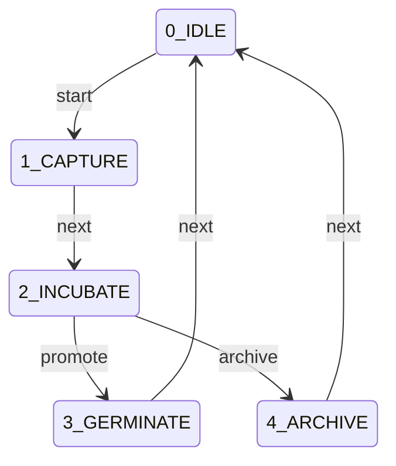

## 🚦 State Definitions

### 0_IDLE
#### ➡️ Transitions
| Trigger | Target State | 🛡️ Gated By |
|:---|:---|:---|
| `start` | **1_CAPTURE** | *(None)* |

---
### 1_CAPTURE
*Idea Recording*

#### 📋 Requirements
| ID | Type | Target | Details |
|:---|:---|:---|:---|
| **idea_file** | `file_exists` | - |  |

#### ➡️ Transitions
| Trigger | Target State | 🛡️ Gated By |
|:---|:---|:---|
| `next` | **2_INCUBATE** | *(None)* |

---
### 2_INCUBATE
*Gated Refinement Dialogue*

#### 📋 Requirements
| ID | Type | Target | Details |
|:---|:---|:---|:---|
| **dialogue_log** | `command_log` | - | Pattern: `node engine/idea.js --refine` |
| **concept_artifact** | `file_exists` | - |  |
| **director_ratification** | `regex_match_output` | - | Pattern: `DLR_IDE_ACK|Approved|Ratified` |

#### ➡️ Transitions
| Trigger | Target State | 🛡️ Gated By |
|:---|:---|:---|
| `promote` | **3_GERMINATE** | *(None)* |
| `archive` | **4_ARCHIVE** | *(None)* |

---
### 3_GERMINATE
*Promotion to Strategy*

#### ➡️ Transitions
| Trigger | Target State | 🛡️ Gated By |
|:---|:---|:---|
| `next` | **0_IDLE** | *(None)* |

---
### 4_ARCHIVE
*Historical Record*

#### ➡️ Transitions
| Trigger | Target State | 🛡️ Gated By |
|:---|:---|:---|
| `next` | **0_IDLE** | *(None)* |

---

---

# Protocol: MAP_V2

**Title:** System Mapping & Contextualization v2  
**Version:** 2.0.0  

> Context precedes Logic: An entity cannot modify what it does not map.

### 📜 Principles
- Adherence to STD_COGNITIVE_FIDELITY: Velocity must never outpace Understanding.

## 📊 Lifecycle Flowchart

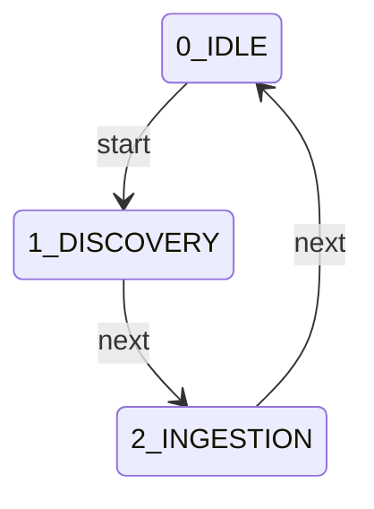

## 🚦 State Definitions

### 0_IDLE
#### ➡️ Transitions
| Trigger | Target State | 🛡️ Gated By |
|:---|:---|:---|
| `start` | **1_DISCOVERY** | *(None)* |

---
### 1_DISCOVERY
*Locate Manifest*

#### 📋 Requirements
| ID | Type | Target | Details |
|:---|:---|:---|:---|
| **metadata_file** | `file_exists` | - |  |

#### ➡️ Transitions
| Trigger | Target State | 🛡️ Gated By |
|:---|:---|:---|
| `next` | **2_INGESTION** | *(None)* |

---
### 2_INGESTION
*Contextual Echo*

#### 📋 Requirements
| ID | Type | Target | Details |
|:---|:---|:---|:---|
| **structural_mapping** | `regex_match_output` | - | Pattern: `\[DLR_MAP_STRUCT\].*` |

#### ➡️ Transitions
| Trigger | Target State | 🛡️ Gated By |
|:---|:---|:---|
| `next` | **0_IDLE** | *(None)* |

---

---

# Protocol: ONBOARD_V4

**Title:** System Onboarding & Philosophy v4  
**Version:** 4.1.0  

> Initial alignment and role assumption.

### 🧠 Philosophy
> Collaborative Stewardship: Aligning Director vision with Engineer execution from Turn 1.

### 📜 Principles
- Adherence to STD_COGNITIVE_FIDELITY: Velocity must never outpace Understanding.
- Director owns Objective & Decision; Engineer owns Execution & Verification.
- Integrity of the codebase is maintained through strict protocol adherence.
- Transparency is achieved through mandatory initial response echoes.

### 👥 Roles & Responsibilities
#### Engineer (Lead Analyst & Implementer)
- Context gathering and technical analysis.
- Transactional implementation and verification.
- Maintaining bit-perfect audit fidelity.

#### Director (System Arbiter & Mission Lead)
- Strategic intent definition and mission briefing.
- Gate authorization and plan approval.
- Final compliance ratification and seal.

#### Oracle (System Mentor & Knowledge Authority)
- Providing semantic and structural guidance.
- Interactive induction and module-based learning.
- Clarifying system standards and protocol logic.

## 📊 Lifecycle Flowchart

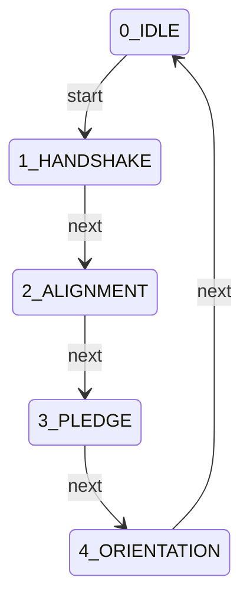

## 🚦 State Definitions

### 0_IDLE
#### ➡️ Transitions
| Trigger | Target State | 🛡️ Gated By |
|:---|:---|:---|
| `start` | **1_HANDSHAKE** | *(None)* |

---
### 1_HANDSHAKE
*Protocol Handshake*

#### 📋 Requirements
| ID | Type | Target | Details |
|:---|:---|:---|:---|
| **onboard_tool** | `command_log` | - | Pattern: `node engine/onboard.js` |
| **echo_dlr_headers** | `regex_match_output` | - | Pattern: `\[DLR_HND_ONBOARD\].*(Principles Echo|Role Acceptance|Registry Mapping|Domain Awareness)` |

#### ➡️ Transitions
| Trigger | Target State | 🛡️ Gated By |
|:---|:---|:---|
| `next` | **2_ALIGNMENT** | *(None)* |

---
### 2_ALIGNMENT
*ZK Fidelity Alignment*

#### 📋 Requirements
| ID | Type | Target | Details |
|:---|:---|:---|:---|
| **alignment_success** | `regex_match_output` | - | Pattern: `ZK FIDELITY ALIGNED` |

#### ➡️ Transitions
| Trigger | Target State | 🛡️ Gated By |
|:---|:---|:---|
| `next` | **3_PLEDGE** | *(None)* |

---
### 3_PLEDGE
*Behavioral Pledge*

#### 📋 Requirements
| ID | Type | Target | Details |
|:---|:---|:---|:---|
| **behavioral_pledge_cert** | `file_exists` | - |  |
| **quiz_success** | `regex_match_output` | - | Pattern: `VERIFICATION SUCCESSFUL` |

#### ➡️ Transitions
| Trigger | Target State | 🛡️ Gated By |
|:---|:---|:---|
| `next` | **4_ORIENTATION** | *(None)* |

---
### 4_ORIENTATION
*Project Orientation*

#### 📋 Requirements
| ID | Type | Target | Details |
|:---|:---|:---|:---|
| **project_orientation_tool** | `command_log` | - | Pattern: `node engine/onboard.js --project` |
| **orientation_complete** | `regex_match_output` | - | Pattern: `Orientation Complete` |

#### ➡️ Transitions
| Trigger | Target State | 🛡️ Gated By |
|:---|:---|:---|
| `next` | **0_IDLE** | *(None)* |

---

---

# Protocol: OPTIMISE_V2

**Title:** Structural Evolution & Refactoring v2  
**Version:** 2.0.0  

> Friction-to-Flow: Structural improvement without regression.

### 📜 Principles
- Adherence to STD_COGNITIVE_FIDELITY: Velocity must never outpace Understanding.

## 📊 Lifecycle Flowchart

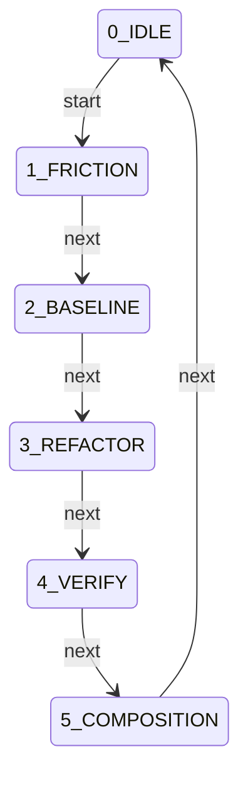

## 🚦 State Definitions

### 0_IDLE
#### ➡️ Transitions
| Trigger | Target State | 🛡️ Gated By |
|:---|:---|:---|
| `start` | **1_FRICTION** | *(None)* |

---
### 1_FRICTION
*Detection*

#### ➡️ Transitions
| Trigger | Target State | 🛡️ Gated By |
|:---|:---|:---|
| `next` | **2_BASELINE** | *(None)* |

---
### 2_BASELINE
*Guardrail*

#### 📋 Requirements
| ID | Type | Target | Details |
|:---|:---|:---|:---|
| **performance_ceiling** | `command_log` | - | Pattern: `VAL_V2` |

#### ➡️ Transitions
| Trigger | Target State | 🛡️ Gated By |
|:---|:---|:---|
| `next` | **3_REFACTOR** | *(None)* |

---
### 3_REFACTOR
*Execution*

#### 📋 Requirements
| ID | Type | Target | Details |
|:---|:---|:---|:---|
| **gsd_cycle** | `command_log` | - | Pattern: `GSD_V4` |

#### ➡️ Transitions
| Trigger | Target State | 🛡️ Gated By |
|:---|:---|:---|
| `next` | **4_VERIFY** | *(None)* |

---
### 4_VERIFY
*Regression Check*

#### ➡️ Transitions
| Trigger | Target State | 🛡️ Gated By |
|:---|:---|:---|
| `next` | **5_COMPOSITION** | *(None)* |

---
### 5_COMPOSITION
*History Update*

#### 📋 Requirements
| ID | Type | Target | Details |
|:---|:---|:---|:---|
| **matrix_update** | `command_log` | - | Pattern: `node utils/update_matrix.js` |

#### ➡️ Transitions
| Trigger | Target State | 🛡️ Gated By |
|:---|:---|:---|
| `next` | **0_IDLE** | *(None)* |

---

---

# Protocol: PIR_V4

**Title:** Post-Implementation Review Standard v4 (Interaction Report)  
**Version:** 4.2.0  

> Actionable post-mortem and knowledge persistence engine.

### 📜 Principles
- Adherence to STD_COGNITIVE_FIDELITY: Velocity must never outpace Understanding.

## 📊 Lifecycle Flowchart

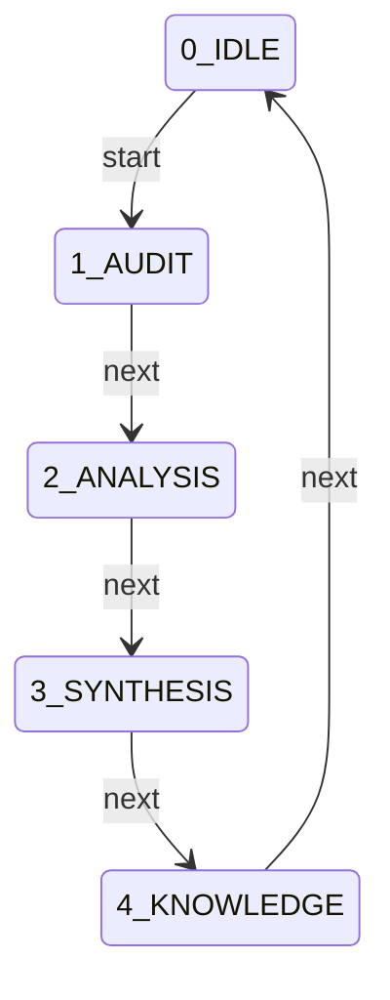

## 🚦 State Definitions

### 0_IDLE
#### ➡️ Transitions
| Trigger | Target State | 🛡️ Gated By |
|:---|:---|:---|
| `start` | **1_AUDIT** | *(None)* |

---
### 1_AUDIT
*Context Collection*

#### 📋 Requirements
| ID | Type | Target | Details |
|:---|:---|:---|:---|
| **fidelity_status** | `regex_match_output` | - | Pattern: `STABLE` |

#### ➡️ Transitions
| Trigger | Target State | 🛡️ Gated By |
|:---|:---|:---|
| `next` | **2_ANALYSIS** | *(None)* |

---
### 2_ANALYSIS
*Root Cause Analysis*

#### 📋 Requirements
| ID | Type | Target | Details |
|:---|:---|:---|:---|
| **interaction_report** | `regex_match_output` | - | Pattern: `DLR_RPT_INTERACTION` |
| **anomaly_analysis** | `regex_match_output` | - | Pattern: `Anomaly Analysis` |

#### ➡️ Transitions
| Trigger | Target State | 🛡️ Gated By |
|:---|:---|:---|
| `next` | **3_SYNTHESIS** | *(None)* |

---
### 3_SYNTHESIS
*Remediation Strategy*

#### 📋 Requirements
| ID | Type | Target | Details |
|:---|:---|:---|:---|
| **remediation_table** | `regex_match_output` | - | Pattern: `Remediation Table` |

#### ➡️ Transitions
| Trigger | Target State | 🛡️ Gated By |
|:---|:---|:---|
| `next` | **4_KNOWLEDGE** | *(None)* |

---
### 4_KNOWLEDGE
*Persistence*

#### 📋 Requirements
| ID | Type | Target | Details |
|:---|:---|:---|:---|
| **knowledge_injection** | `file_freshness` | registry/knowledge_base.json |  |
| **knowledge_entry_echo** | `regex_match_output` | - | Pattern: `DLR_KNO_ENTRY` |

#### ➡️ Transitions
| Trigger | Target State | 🛡️ Gated By |
|:---|:---|:---|
| `next` | **0_IDLE** | *(None)* |

---

---

# Protocol: PRY_V2

**Title:** Engineer Proficiency Standard v2  
**Version:** 2.1.0  

> Competence is Demonstrated, not Declared.

### 📜 Principles
- Adherence to STD_COGNITIVE_FIDELITY: Velocity must never outpace Understanding.

## 📊 Lifecycle Flowchart

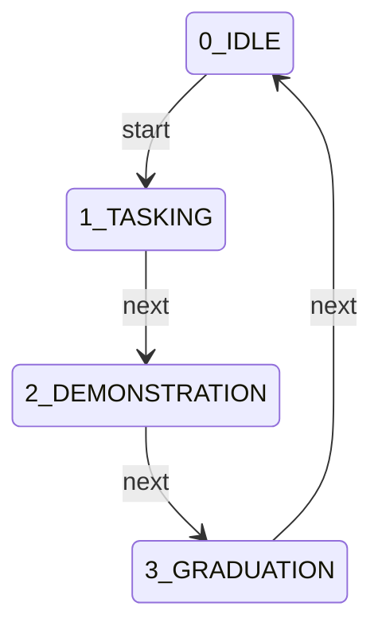

## 🚦 State Definitions

### 0_IDLE
#### ➡️ Transitions
| Trigger | Target State | 🛡️ Gated By |
|:---|:---|:---|
| `start` | **1_TASKING** | *(None)* |

---
### 1_TASKING
*Task Definition*

#### ➡️ Transitions
| Trigger | Target State | 🛡️ Gated By |
|:---|:---|:---|
| `next` | **2_DEMONSTRATION** | *(None)* |

---
### 2_DEMONSTRATION
*Procedural Execution*

#### 📋 Requirements
| ID | Type | Target | Details |
|:---|:---|:---|:---|
| **gsd_cycle** | `command_log` | - | Pattern: `node engine/warden.js close` |

#### ➡️ Transitions
| Trigger | Target State | 🛡️ Gated By |
|:---|:---|:---|
| `next` | **3_GRADUATION** | *(None)* |

---
### 3_GRADUATION
*Certification*

#### 📋 Requirements
| ID | Type | Target | Details |
|:---|:---|:---|:---|
| **pry_cert** | `regex_match_output` | - | Pattern: `\[DLR_CRT_PROFICIENCY\].*` |

#### ➡️ Transitions
| Trigger | Target State | 🛡️ Gated By |
|:---|:---|:---|
| `next` | **0_IDLE** | *(None)* |

---

---

# Protocol: ROADMAP_V2

**Title:** Strategic Roadmap Evolution v2  
**Version:** 2.0.0  

> Intentional Evolution: Strategic planning.

### 📜 Principles
- Adherence to STD_COGNITIVE_FIDELITY: Velocity must never outpace Understanding.

## 📊 Lifecycle Flowchart

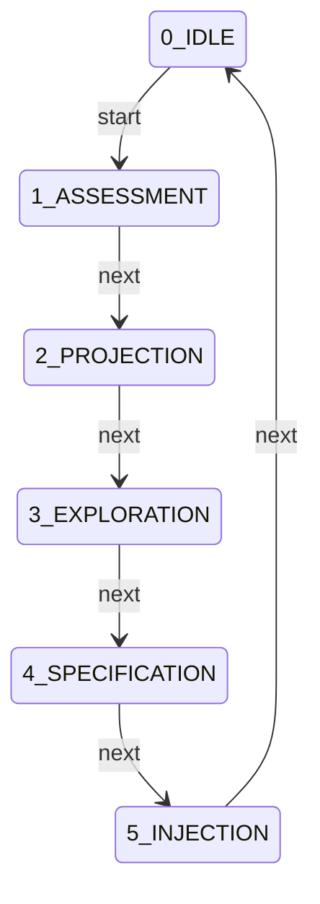

## 🚦 State Definitions

### 0_IDLE
#### ➡️ Transitions
| Trigger | Target State | 🛡️ Gated By |
|:---|:---|:---|
| `start` | **1_ASSESSMENT** | *(None)* |

---
### 1_ASSESSMENT
*State Review*

#### ➡️ Transitions
| Trigger | Target State | 🛡️ Gated By |
|:---|:---|:---|
| `next` | **2_PROJECTION** | *(None)* |

---
### 2_PROJECTION
*Future Mapping*

#### ➡️ Transitions
| Trigger | Target State | 🛡️ Gated By |
|:---|:---|:---|
| `next` | **3_EXPLORATION** | *(None)* |

---
### 3_EXPLORATION
*Brainstorming*

#### ➡️ Transitions
| Trigger | Target State | 🛡️ Gated By |
|:---|:---|:---|
| `next` | **4_SPECIFICATION** | *(None)* |

---
### 4_SPECIFICATION
*Feature Definition*

#### ➡️ Transitions
| Trigger | Target State | 🛡️ Gated By |
|:---|:---|:---|
| `next` | **5_INJECTION** | *(None)* |

---
### 5_INJECTION
*Finalization*

#### 📋 Requirements
| ID | Type | Target | Details |
|:---|:---|:---|:---|
| **roadmap_update** | `file_exists` | - |  |

#### ➡️ Transitions
| Trigger | Target State | 🛡️ Gated By |
|:---|:---|:---|
| `next` | **0_IDLE** | *(None)* |

---

---

# Protocol: STAT_V2

**Title:** Automated Status Reporting v2  
**Version:** 2.0.0  

> System Pulse: Real-time visibility into health and debt.

### 📜 Principles
- Adherence to STD_COGNITIVE_FIDELITY: Velocity must never outpace Understanding.

## 📊 Lifecycle Flowchart

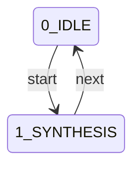

## 🚦 State Definitions

### 0_IDLE
#### ➡️ Transitions
| Trigger | Target State | 🛡️ Gated By |
|:---|:---|:---|
| `start` | **1_SYNTHESIS** | *(None)* |

---
### 1_SYNTHESIS
*Data Aggregation*

#### 📋 Requirements
| ID | Type | Target | Details |
|:---|:---|:---|:---|
| **status_tool** | `command_log` | - | Pattern: `node docs/generate_status.js` |
| **status_artifact** | `regex_match_output` | - | Pattern: `\[DLR_MAN_STATUS\].*` |

#### ➡️ Transitions
| Trigger | Target State | 🛡️ Gated By |
|:---|:---|:---|
| `next` | **0_IDLE** | *(None)* |

---

---

# Protocol: VAL_V2

**Title:** Concurrency Validation v2  
**Version:** 2.0.0  

> Heisenbug Hunting: Stability requires iterative verification.

### 📜 Principles
- Adherence to STD_COGNITIVE_FIDELITY: Velocity must never outpace Understanding.

## 📊 Lifecycle Flowchart

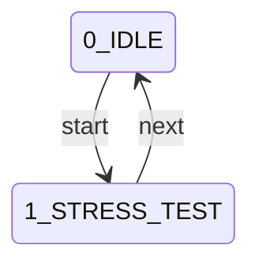

## 🚦 State Definitions

### 0_IDLE
#### ➡️ Transitions
| Trigger | Target State | 🛡️ Gated By |
|:---|:---|:---|
| `start` | **1_STRESS_TEST** | *(None)* |

---
### 1_STRESS_TEST
*Sequential Run*

#### 📋 Requirements
| ID | Type | Target | Details |
|:---|:---|:---|:---|
| **iteration_log** | `regex_match_output` | - | Pattern: `100% hash parity` |

#### ➡️ Transitions
| Trigger | Target State | 🛡️ Gated By |
|:---|:---|:---|
| `next` | **0_IDLE** | *(None)* |

---

---

# Protocol: VFY_V2

**Title:** Protocol Integrity & Artifact Audit v2  
**Version:** 2.2.0  

> Automated governance fidelity and proactive artifact analysis.

### 🧠 Philosophy
> Trust but Verify: Governance is only as strong as its active audit trail.

### 📜 Principles
- Adherence to STD_COGNITIVE_FIDELITY: Velocity must never outpace Understanding.

## 📊 Lifecycle Flowchart

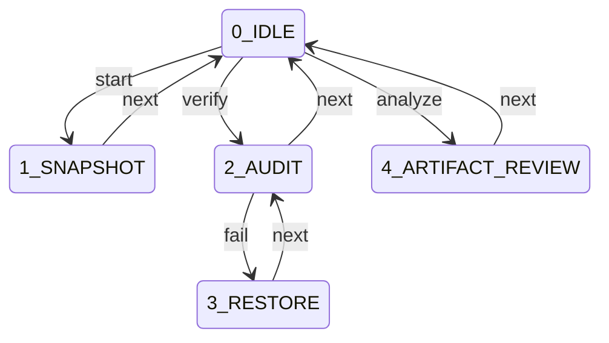

## 🚦 State Definitions

### 0_IDLE
#### ➡️ Transitions
| Trigger | Target State | 🛡️ Gated By |
|:---|:---|:---|
| `start` | **1_SNAPSHOT** | *(None)* |
| `verify` | **2_AUDIT** | *(None)* |
| `analyze` | **4_ARTIFACT_REVIEW** | *(None)* |

---
### 1_SNAPSHOT
*Baseline Creation*

#### 📋 Requirements
| ID | Type | Target | Details |
|:---|:---|:---|:---|
| **snapshot_tool** | `command_log` | - | Pattern: `node validation/verify_integrity.js --snapshot` |

#### ➡️ Transitions
| Trigger | Target State | 🛡️ Gated By |
|:---|:---|:---|
| `next` | **0_IDLE** | `snapshot_tool` |

---
### 2_AUDIT
*Fidelity Verification*

#### 📋 Requirements
| ID | Type | Target | Details |
|:---|:---|:---|:---|
| **verify_tool** | `command_log` | - | Pattern: `node validation/verify_integrity.js --verify` |

#### ➡️ Transitions
| Trigger | Target State | 🛡️ Gated By |
|:---|:---|:---|
| `next` | **0_IDLE** | `verify_tool` |
| `fail` | **3_RESTORE** | *(None)* |

---
### 3_RESTORE
*Integrity Restoration*

#### 📋 Requirements
| ID | Type | Target | Details |
|:---|:---|:---|:---|
| **restore_tool** | `command_log` | - | Pattern: `node validation/verify_integrity.js --restore` |

#### ➡️ Transitions
| Trigger | Target State | 🛡️ Gated By |
|:---|:---|:---|
| `next` | **2_AUDIT** | `restore_tool` |

---
### 4_ARTIFACT_REVIEW
*Active Output Analysis*

#### 📋 Requirements
| ID | Type | Target | Details |
|:---|:---|:---|:---|
| **artifact_read** | `command_log` | - | Pattern: `cat|read_file` |
| **artifact_audit** | `regex_match_output` | - | Pattern: `DLR_AUD_ARTIFACT` |

#### ➡️ Transitions
| Trigger | Target State | 🛡️ Gated By |
|:---|:---|:---|
| `next` | **0_IDLE** | *(None)* |

---

---

## 🕒 Governance Evolution

### v9.21.21 (2026-01-20)
- Final system synchronization after pathing debt purge

### v9.21.20 (2026-01-20)
- Purged legacy static pathing technical debt
- Unified 100% of toolchain under the functional resolve API
- Corrected template syntax errors in multiple scripts

### v9.21.19 (2026-01-20)
- Reordered README sections: Operational Guidance moved before Integrity Model

### v9.21.18 (2026-01-20)
- Uplifted README.md to high-fidelity technical manual
- Externalized qualitative prose into registry/prose/
- Implemented context-aware README generation (Local vs Proxy)
- Refactored generate_protocols.js to isolate engine induction logs

### v9.21.17 (2026-01-20)
- Refreshed core documentation to reflect finalized IDEA-039 architecture (Post-Refactor Refresh)

### v9.21.16 (2026-01-20)
- Refreshed local documentation and synchronized project-centric generators

### v9.21.15 (2026-01-20)
- Uplifted README.md verbosity and detail
- Implemented context-aware generation for Local vs Proxy modes
- Resolved technical debt in documentation generators

### v9.21.14 (2026-01-20)
- Finalized Global Engine Configuration (Domain 6)

### v9.21.13 (2026-01-20)
- Implemented Global Engine Configuration (Domain 6)
- Added 'system config' command suite
- Established central config.json with environment overrides

### v9.21.12 (2026-01-20)
- Finalized Project Fleet Management (Domain 5)

### v9.21.11 (2026-01-20)
- Implemented Project Fleet Management (Domain 5)
- Added 'system list', 'system prune', and 'system heartbeat' commands
- Hardened path_resolver.js with global and project resolution helpers
- Refactored toolchain for consistent context-aware execution

### v9.21.10 (2026-01-20)
- Refreshed core documentation to reflect finalized IDEA-039 architecture (Local Refresh)

### v9.21.9 (2026-01-20)
- Refreshed core documentation to reflect finalized IDEA-039 architecture

### v9.21.8 (2026-01-20)
- Refactored documentation generators for Project-Centric mode (Finalized)

### v9.21.7 (2026-01-20)
- Refactored documentation generators for Project-Centric mode
- Separated System vs Project changelog rendering
- Cleaned up generate_protocols.js to exclude engine-level artifacts in Proxy Mode

### v9.21.6 (2026-01-20)
- Migrated system changelog to .warden/changelog.json for architectural parity

### v9.21.5 (2026-01-20)
- Operationalized project-centric documentation workflow
- Implemented dual-changelog logic (System vs Project)
- Refactored generate_readme.js for Proxy Mode (Manifesto)
- Updated glossary and standards generators for registry overlays

### v9.21.4 (2026-01-20)
- Purged legacy static pathing technical debt
- Fixed path normalization in engine/patch.js
- Unified 100% of toolchain under the functional resolve API

### v9.21.3 (2026-01-20)
- Purged legacy static pathing technical debt
- Unified 100% of toolchain under the functional resolve API
- Fully aligned with IDEA-039 decoupled architecture

### v9.21.2 (2026-01-20)
- "Implemented
- warden system init
- for
- project
- injection"
- "Automated
- project
- scaffolding
- and
- context-aware
- proxy
- generation"
- "Established
- global
- project
- inventory
- in
- engine
- state"

### v9.21.1 (2026-01-20)
- Flattened project anchor structure (removed history/ subdirectory)
- Consolidated patches into .warden/patches/

### v9.21.0 (2026-01-20)
- Refactored path_resolver.js for Dual-Mode Portability (IDEA-039)
- Implemented Registry Overlay Model (Local > Global)
- Hardened State Firewall for decoupled project anchors
- Simplified patch storage to .warden/patches/

### v9.20.0 (2026-01-20)
- Refactored path_resolver.js for Dual-Mode Portability (IDEA-039)
- Implemented Registry Overlay Model (Local > Global)
- Hardened State Firewall for decoupled project anchors
- Simplified patch storage to .warden/patches/

### v9.19.4 (2026-01-18)
- portable_pathing

### v9.19.3 (2026-01-18)
- baseline

### v9.19.2 (2026-01-15)
- FEAT_LivingMaps

### v9.19.1 (2026-01-15)
- Add Version and Generated headers to README and BACKLOG generators

### v9.19.0 (2026-01-15)
- Codify STD_COGNITIVE_FIDELITY standard
- Update Onboarding Pledge with Understanding vs Velocity scenario
- Standardize meta.principles across all 17 protocols

### v9.18.0 (2026-01-15)
- Upgrade GSD_V5 to v5.9.0 with mandatory Feature Spec artifact
- Refactor engine/idea.js to support full IDEA_V1 lifecycle
- Register DLR_DOC_FEAT and STD_FEAT_STRUCT in registry

### v9.17.0 (2026-01-15)
- Implement CON-008: Structured Idea-to-Concept Taxonomy
- Upgrade IDEA_V1 to v1.1.0 with Gated Incubation Loop
- Register DLR_IDE_ACK in deliverables registry

### v9.16.11 (2026-01-14)
- Synchronized docs/BACKLOG.md with latest implementation status
- Verified bit-perfect parity between registry and documentation

### v9.16.10 (2026-01-14)
- Completed implementation review of FEAT_STREAMLINED_ONBOARDING
- Verified Proxy Guard and Stale State Guard logic
- Confirmed action-oriented UI prompts in warden.js

### v9.16.9 (2026-01-14)
- Finalizing streamlined onboarding mission

### v9.16.8 (2026-01-14)
- Updated FEAT_STRUCTURED_AUDIT.md to LIVE status
- Documented deep-stack scoping and ID-First matching
- Synchronized terminology with registry (DLR_ASM_COMPLIANCE)

### v9.16.7 (2026-01-14)
- Implemented ID-First matching logic in matchClaim
- Added sanitizeCommand helper for fuzzy normalization
- Reduced false-negative OMISSIONs during ratification

### v9.16.6 (2026-01-14)
- Synchronized backlog with FEAT implementation status
- Patched backlog.js with close command and path resolution
- Codified technical debt for Latching and Streamlining

### v9.16.5 (2026-01-14)
- Implemented metadata-driven audit scoping
- Fixed tool-matching regression in normalizeCommand
- Enabled parent-cycle visibility for CAP_V1

### v9.16.4 (2026-01-14)
- Implemented resolve.shadow helper
- Registered SOURCES.ENGINEER_REPORT
- Refactored patch.js and report.js
- Eliminated legacy fallbacks in loader.js and audit_standards.js
- Fixed bug in generate_protocols.js

### v9.16.3 (2026-01-14)
- Implemented resolve.shadow helper
- Registered SOURCES.ENGINEER_REPORT
- Refactored patch.js and report.js
- Eliminated legacy fallbacks in loader.js and audit_standards.js

### v9.16.2 (2026-01-13)
- Purge legacy reporting scripts

### v9.16.1 (2026-01-13)
- Harden behavioral pledge with qualitative analysis

### v9.16.0 (2026-01-13)
- Implement Cognitive Interjection Presentation Layer (FEAT_COGNITIVE_INTERJECTION)
- Implement Double-Lock Delivery Handshake

### v9.15.1 (2026-01-13)
- Finalize Universal Oracle

### v9.15.0 (2026-01-13)
- Implement Universal Oracle Uplift (FEAT_UNIVERSAL_ORACLE)
- Implement Recursive Schema Engine for Blueprints

### v9.14.2 (2026-01-13)
- Ratify read-only intent expansion and runtime hardening

### v9.14.1 (2026-01-13)
- Finalize Portable Resolver

### v9.14.0 (2026-01-13)
- Implement Deterministic Portable Path Resolver (FEAT_PORTABLE_RESOLVER)
- Refactor core tools to use absolute pathing
- Codify STD_PORTABLE_PATHS

### v9.13.3 (2026-01-13)
- Ratify high-fidelity feature documentation

### v9.13.2 (2026-01-13)
- Rename and consolidate design documents to FEAT identifiers

### v9.13.1 (2026-01-13)
- Ratify System Stability post-Implementation Analysis

### v9.13.0 (2026-01-13)
- Implement Canonical Command Model (FEAT_STRUCTURED_AUDIT)
- Implement Socratic Brake interjection logic
- Consolidate reporting tools into unified engine/report.js

### v9.12.0 (2026-01-13)
- Implement Canonical Command Model (FEAT_STRUCTURED_AUDIT)
- Implement Socratic Brake interjection logic
- Consolidate reporting tools into unified engine/report.js

### v9.11.0 (2026-01-13)
- Implement Modular Protocol Registry (FEAT_MODULAR_REGISTRY)
- Implement Virtual Join logic in GovernanceAPI and Loader
- Create Library Auditor for manifest-driven integrity hashing

### v9.10.0 (2026-01-13)
- Refactor ONBOARD_V4 to metadata-driven state machine
- Remove hard-coded induction logic from onboard.js
- Migrate induction state files to consolidated directory

### v9.9.51 (2026-01-13)
- Codified STD_METADATA_PRIMACY standard.

### v9.9.50 (2026-01-13)
- Refactored Nested Protocol Enforcement to Metadata-Driven Architecture

### v9.9.49 (2026-01-12)
- Hardened GSD_V5 Finalize Gate with 3-Way Compliance integration.

### v9.9.48 (2026-01-12)
- Hardened GSD_V5 Finalize Gate with 3-Way Compliance integration.

### v9.9.47 (2026-01-11)
- Refine provenance workflow to trust auto-signed echoes
- Suppress Protocol Breach warning for verified tokens
- Implement post-execution provenance check in warden.js

### v9.9.46 (2026-01-11)
- Implement automated hash signatures for Acknowledgements in warden.js
- Add automated telemetry and session ID calculation in report.js
- Verified bit-perfect auto-population of Phase A schemas

### v9.9.45 (2026-01-11)
- Upgrade all Core Audit Loop deliverables (ACK, AUD, RPT) to High-Fidelity schemas
- Implement SHA-256 hash_ref and telemetry property definitions
- Verified bit-perfect blueprint generation for all uplifted items

### v9.9.44 (2026-01-11)
- Perform deep semantic analysis of all 25 system deliverables
- Generate SCHEMA_ANALYSIS.md with proposed JSON Schema upgrades
- Group deliverables by Kind for shared schema traits

### v9.9.43 (2026-01-11)
- Rename all deliverables to DLR_<KIND>_<SUBKIND> format
- Update protocol references to match new taxonomy
- Implement validation/audit_taxonomy.js

### v9.9.42 (2026-01-11)
- Implement recursive JSON Schema parsing in oracle.js
- Upgrade DLR_MSN_BRIEF and DLR_GSD_PLAN to High-Fidelity format
- Update validation suite for schema compatibility

### v9.9.41 (2026-01-11)
- Transition Interaction Report to structured JSON model
- Implement deterministic claim matching in compliance.js
- Add --json flag to report.js

### v9.9.40 (2026-01-11)
- Implement dynamic JSON blueprint generation in oracle.js
- Add smart initialization for plural schema keys
- Implement automated blueprint audit script

### v9.9.39 (2026-01-11)
- Clarify Onboarding Hold Protocol in engine/onboard.js

### v9.9.38 (2026-01-10)
- --auto-close
- Implemented Oracle Blueprints (FEAT_ORACLE_BLUEPRINTS)
- Added blueprint command and Concept Registry guidance

### v9.9.37 (2026-01-10)
- --auto-close
- Groomed Governance Backlog
- Closed 6 items and restored onboarding visibility

### v9.9.36 (2026-01-10)
- --auto-close
- Codified CON-002 (Universal Guidance Engine)
- Added verbose technical specification and Oracle fallback logic

### v9.9.35 (2026-01-10)
- --auto-close
- Implemented Universal Registry & Guidance Engine
- Decoupled deliverables and implemented multi-source synthesis

### v9.9.34 (2026-01-10)
- --auto-close
- Formalized Concept Registry
- Added registry/concepts and engine/concept.js tool

### v9.9.33 (2026-01-10)
- --auto-close
- Expanded GSD Tutorial to Full Lifecycle
- Implemented Director Proxy and remediated registry structural fidelity

### v9.9.32 (2026-01-10)
- --auto-close
- Implemented Oracle Tutorial (Mode A)
- Hardened warden.js logging and added tutorial engine

### v9.9.31 (2026-01-10)
- --auto-close
- Implemented Oracle Sandbox (Mode B)
- Decoupled engine paths and added sandbox command

### v9.9.30 (2026-01-10)
- --auto-close
- Expanded Oracle Guidance Registry
- Added 4 new complex audit topics to registry/guidance.json

### v9.9.29 (2026-01-10)
- --auto-close
- Remediated role schema inconsistency
- Fixed generator crash by adding responsibilities array

### v9.9.28 (2026-01-10)
- --auto-close
- Integrated Warden Oracle into Onboarding
- Updated role model and induction scope

### v9.9.27 (2026-01-10)
- --auto-close
- Implemented Warden Oracle (FEAT_WARDEN_ORACLE)
- Added engine/oracle.js and registry/guidance.json

### v9.9.26 (2026-01-10)
- --auto-close
- Finalized Idea Management System
- Corrected finalization sequence

### v9.9.25 (2026-01-10)
- --auto-close
- Implemented Idea Management System
- Added IDEA_V1 protocol and engine/idea.js tool

### v9.9.24 (2026-01-10)
- --auto-close
- Finalized automated closure
- Fixed recursive logging deadlock and syntax errors

### v9.9.23 (2026-01-10)
- --auto-close
- Remediated recursive closure deadlock
- Refactored warden.js to log before execution

### v9.9.22 (2026-01-10)
- --auto-close
- Implemented Automated Cycle Closure
- Added --auto-close to finalizer.js

### v9.9.21 (2026-01-10)
- Implemented Automated Patch Management
- Hardened GSD with transactional snapshot/save instructions

### v9.9.20 (2026-01-10)
- Restored Exit Gate visibility
- Updated onboarding handshake with PRY and PIR refs

### v9.9.19 (2026-01-10)
- Decoupled Onboarding into Governance and Project phases
- Refactored onboard.js for modularity

### v9.9.18 (2026-01-10)
- Remediated Registry Centralization
- Fixed documentation generator hardcoded paths

### v9.9.17 (2026-01-10)
- Centralized state files into /registry
- Updated path_resolver.js and protocols.json

### v9.9.16 (2026-01-10)
- Implemented Validated SQA Anchoring
- Added --sqa validation to audit_standards.js

### v9.9.15 (2026-01-10)
- Refined Journaling DX
- Fixed onboarding syntax error

### v9.9.14 (2026-01-10)
- Implemented Explicit CLI Documentation
- Enforced JIT Guidance with Example syntax

### v9.9.13 (2026-01-10)
- Implemented proactive gate instructions
- Hardened registry with explicit STOP commands

### v9.9.12 (2026-01-10)
- Analyzed impact of splitting protocols.json
- Rejected split proposal

### v9.9.11 (2026-01-06)
- Codified Engineer Audit
- Relaxed approval gates to support Approved/Ratified language

### v9.9.10 (2026-01-06)
- Refactored Governance Engine for Nested Stacks
- Enabled modular protocol recursion

### v9.9.9 (2026-01-06)
- Refactored GSD Phase 5
- Removed redundant legacy gates
- Delegated compliance to CAP ratification seal

### v9.9.8 (2026-01-06)
- Implemented CAP_V1
- Updated GSD_V5 Phase 5 requirements

### v9.9.7 (2026-01-06)
- Implemented Three-Way Compliance Verification
- Updated compliance.js
- Updated protocols.json

### v9.9.6 (2026-01-06)
- Hardened GSD_V5 with mandatory Director Verification Approval gate.

### v9.9.5 (2026-01-06)
- Hardened GSD_V5 with mandatory Director Plan Approval gate.

### v9.9.4 (2026-01-05)
- Remediated legacy gsd.js reference in PRY_V2 protocol
- Normalized Warden branding references in knowledge base

### v9.9.3 (2026-01-04)
- Normalized Warden for independent operation; remediated separation inconsistencies

### v9.9.2 (2026-01-04)
- Unified gsd.js references into Warden framework

### v9.9.1 (2026-01-04)
- Remediated Autonomous Phase Leap violation
- Reinforced Role Boundaries in Knowledge Base

### v9.9.0 (2026-01-04)
- Implemented Warden Session Logger and Governance Proxy for automated evidence verification.

### v9.8.1 (2026-01-04)
- Operationalized Knowledge Base with automated onboarding pulse and documentation.

### v9.8.0 (2026-01-04)
- Integrated Governance API into Warden and implemented safe protocol lookup for resilience.
- Mandated gov.js usage in GSD_V5 instructions.

### v9.7.0 (2026-01-04)
- Implemented Governance API and gov.js CLI for robust protocol transactions.
- Modernized Warden suite to v1.4.0.

### v9.6.0 (2026-01-04)
- Evolved PIR to V4 with Actionable post-mortems and Knowledge Base persistence.

### v9.5.0 (2026-01-04)
- Implemented GSD_V5 (Quality Engine) and PIR_V3 with SQA anchoring.

### v9.4.0 (2026-01-04)
- Implemented GSD_V5 (Quality Engine) with SQA anchoring and weighted evidence.
- Upgraded PIR to V3 with SQA Impact Reporting.

### v9.3.12 (2026-01-04)
- Performed PIR on Turn Boundary violation in Rename cycle.

### v9.3.11 (2026-01-04)
- Modernized governance testing infrastructure and implemented Warden unit tests.

### v9.3.10 (2026-01-04)
- Implemented dynamic column alignment in verify_integrity.js table output.

### v9.3.9 (2026-01-04)
- Renamed all protocols_v2 artifacts to protocols.

### v9.3.8 (2026-01-04)
- Promoted GSD_V4 to production status by removing the Pilot tag.

### v9.3.7 (2026-01-04)
- Standardized transition triggers to 'next' across the protocol library and enhanced Warden error guidance.

### v9.3.6 (2026-01-04)
- Modularized Warden Governance Engine and decoupled requirement handlers.

### v9.3.5 (2026-01-04)
- Renamed initial transition triggers from 'init' to 'start' across all v2 protocols.

### v9.3.4 (2026-01-04)
- Fully deprecated Protocol v1 and refactored verify_integrity.js.

### v9.3.3 (2026-01-04)
- Deprecated and removed redundant gsd.js wrapper.
- Established warden.js as the single authoritative governance entry point.

### v9.3.2 (2026-01-04)
- Established technical documentation infrastructure for Warden suite in tools/docs/.
- Implemented dynamic README generation for Warden technical artifacts.

### v9.3.1 (2026-01-04)
- Implemented automated JSON repair in validator and grace windows in Warden to reduce protocol friction.

### v9.3.0 (2026-01-04)
- Unified session authority under Protocol v2 and Warden framework.
- Refactored toolchain for state-machine governance.

### v9.2.0 (2026-01-04)
- Implemented Warden Governance Engine for dynamic Protocol v2 enforcement.
- Refactored gsd.js as a wrapper for Warden.

### v9.1.12 (2026-01-04)
- Refined DLR_ONB_HANDSHAKE with mandatory schema and enhanced ONBOARD_V4 enforcement.

### v9.1.11 (2026-01-04)
- Enhanced verify_integrity.js to support multi-library auditing and Protocol v2 enforcement.

### v9.1.10 (2026-01-04)
- Aligned Protocol v2 title and bootstrap formatting with v1.

### v9.1.9 (2026-01-04)
- Achieved 100% detail parity between Protocol v1 and v2 documentation.

### v9.1.8 (2026-01-04)
- Migrated all remaining protocols to Protocol v2 Library.

### v9.1.7 (2026-01-04)
- Refactored Protocol v2 to Library structure and migrated VFY Protocol.

### v9.1.6 (2026-01-04)
- Migrated GSD metadata and detailed specifications from Protocol v1 to v2.

### v9.1.5 (2026-01-04)
- Implemented Protocol v2 documentation generator and generated PROTOCOLS_v2.md.

### v9.1.4 (2026-01-04)
- Implemented Protocol v2 Schema and Validator for Integrity Enforcement.

### v9.1.3 (2026-01-04)
- Designed and implemented Protocol v2.0 Schema pilot (GSD_V4).

### v9.1.2 (2026-01-04)
- Codified Atomic Turn Enforcement in GSD_V3 to prevent unauthorized phase transitions.

### v9.1.1 (2026-01-04)
- Removed git status dependency from STAT_V1 reporting.

### v9.1.0 (2026-01-04)
- Implemented tools/gsd.js for active GSD state tracking and gate enforcement.
- Updated GSD_V3 protocol to mandate tools/gsd.js usage.

### v9.0.10 (2026-01-04)
- Expanded VFY_V1 coverage to include deliverable_registry and compliance_registry via _GLOBAL_REGISTRIES.

### v9.0.9 (2026-01-04)
- Clarified PRY_V1 transition in onboard.js output.

### v9.0.8 (2026-01-04)
- Clarified DLR_VFY_SNAPSHOT persistence file path.

### v9.0.7 (2026-01-04)
- Standardized nomenclature by replacing 'Ratification' with 'Approval' across all protocols and documentation.
- Renamed EVO_V1 key 'ratification_standard' to 'approval_standard' for schema consistency.
- Synchronized all governance gates and historical records with the new approval standard.

### v9.0.6 (2026-01-04)
- Removed redundant Bootstrap section from README.md.
- Centralized session initialization instructions in the System Protocol Library.

### v9.0.5 (2026-01-04)
- Codified the Compliance Registry (CMP_ identifiers) to formalize development constraints.
- Updated PIR_V1 to mandate auditing against the codified compliance framework.
- Enhanced verify_integrity.js and generate_protocols.js to support the new registry.

### v9.0.4 (2026-01-04)
- Integrated Friction Disclosure into PIR_V1 compliance audit.
- Codified 'High Friction Signal' as a trigger for EVO_V1 evolution.
- Updated deliverable_registry and onboarding to reflect dual-purpose auditing.

### v9.0.2 (2026-01-04)
- Added total protocol count to the verify_integrity.js audit output.
- Improved audit summary visibility for governance verification turns.

### v9.0.1 (2026-01-04)
- Optimized Deliverable Registry UI in PROTOCOLS.md using vertical detail blocks.
- Improved readability for CLI and standard displays without detail loss.
- Maintained cross-protocol anchor links for DLR_ identifiers.

### v9.0.0 (2026-01-04)
- Implemented Evidence-Based Verification and Confidence Scoring in VFY_V1 and PIR_V1.
- Upgraded deliverable_registry with confidence weighting for high-value artifacts.
- Implemented automated hyperlinking for DLR_ identifiers in PROTOCOLS.md.
- Bridged the gap between mechanical verification and cognitive integrity.

### v8.5.9 (2026-01-04)
- Implemented centralized Deliverable Registry in protocols.json.
- Updated all protocols to reference codified DLR_ IDs.
- Enhanced tools/verify_integrity.js with automated referential integrity auditing.
- Updated tools/generate_protocols.js to render the high-verbosity deliverable glossary.

### v8.5.8 (2026-01-04)
- Codified mandatory Protocol Compliance Audit in PIR_V1.
- Added self-audit step to PIR operational workflow to ensure procedural adherence.
- Synchronized governance documentation with the new review standard.

### v8.5.7 (2026-01-04)
- Renamed REV_V1 to PIR_V1 (Post-Implementation Review) for improved descriptive clarity.
- Implemented FIX_V1 (Emergency Recovery Standard) to codify hotfix procedures.
- Synchronized governance history and documentation with new nomenclature.

### v8.5.6 (2026-01-04)
- Recovered tools/onboard.js from syntax regressions introduced during schema evolution.
- Hardened template literal handling in the Knowledge Pulse briefing.
- Restored full functional parity for the Actionable Onboarding entry point.

### v8.5.5 (2026-01-04)
- Implemented Active Knowledge Refresh mechanism via onboard.js --refresh.
- Codified mandatory Knowledge Pulse in GSD_V3 Phase 1 Survey.
- Updated EVO_V1 to mandate re-synchronization after protocol amendments.

### v8.5.4 (2026-01-04)
- Decoupled governance history from the application baseline.
- Established tools/governance_changelog.json as the authoritative governance record.
- Updated tools/generate_protocols.js to render the Governance Evolution history.
- Refactored tools/finalizer.js to support the --gov routing flag.

### v8.5.3 (2026-01-04)
- Implemented high-verbosity side-by-side fidelity comparison in VFY_V1.
- Hardened integrity diff logic to resiliently handle and report schema regressions.
- Improved visibility into granular protocol changes during the verification phase.

### v8.5.2 (2026-01-04)
- Integrated VFY and REV protocols directly into GSD_V3 operational phases.
- Hardened tools/finalizer.js to enforce integrity checks before committing.
- Eliminated 'Phantom Gate' risk by synchronizing governance documentation with automation machinery.

### v8.5.1 (2026-01-04)
- Implemented dynamic semantic versioning in tools/finalizer.js.
- Added support for --major, --minor, and --patch CLI flags.
- Codified version justification in PIR_V1 review standard.

### v8.5.0 (2026-01-04)
- Upgraded ONBOARD_V3 to include the PRY_V1 proficiency exit gate.
- Implemented PRY_V1 (Engineer Proficiency Standard) to formalize procedural demonstration.
- Updated tools/onboard.js to reflect the pending Engineer status during onboarding.

### v8.4.2 (2026-01-04)
- Implemented PIR_V1 (Post-Implementation Review Standard) to formalize development cycle closure.
- Integrated PIR_V1 as a mandatory step in GSD_V3 Phase 5 finalization.
- Ensured debug history and process transparency are codified in system reviews.

### v8.4.1 (2026-01-04)
- Implemented ENV_V1 (Environment Standard) and VFY_V1 (Protocol Integrity Verification).
- Created tools/verify_integrity.js to perform protocol snapshotting and fidelity audits.
- Standardized pre-flight and post-flight integrity checks for governance changes.

### v8.4.0 (2026-01-04)
- Implemented MAP_V1 (System Mapping & Contextualization) protocol to bridge the zero-knowledge gap.
- Standardized the 'Discovery & Mapping' process to maintain protocol modularity.
- Updated tools/onboard.js to automate the MAP_V1 discovery phase.
- Incremented system version to v8.4.0 reflecting the major structural addition.

### v8.3.13 (2026-01-03)
- Implemented actionable onboarding via tools/onboard.js.
- Updated Bootstrap instructions to prioritize execution over passive reading.
- Codified environmental validation in ONBOARD_V2 and DOC_V1 standards.

### v8.3.12 (2026-01-03)
- Restored Bootstrap instruction formatting in PROTOCOLS.md (regression fix).
- Ensured multi-line code block parity between documentation generators.

### v8.3.11 (2026-01-03)
- Unified all protocol interaction standards into a consistent trigger-based tabular schema.
- Refactored tools/generate_protocols.js with dynamic table rendering for *_standard keys.
- Eliminated orphan strings and descriptive prose from the protocol library interaction rules.

### v8.3.10 (2026-01-03)
- Renamed documentation heading to 'System Protocol Library' for improved descriptive accuracy.

### v8.3.9 (2026-01-03)
- Standardized interaction standards across ONBOARD_V2, GSD_V3, and VAL_V1 using codified tables.
- Updated tools/generate_protocols.js to support new tabular rendering keys.
- Maintained operational workflow integrity across all protocol amendments.

### v8.3.8 (2026-01-03)
- Codified EVO_V1 Post-Mortem Standard as a structured interaction rule.
- Updated tools/generate_protocols.js to support Post-Mortem Standard tabular rendering.
- Improved cross-protocol consistency by standardizing trigger points.

### v8.3.7 (2026-01-03)
- Implemented tools/finalizer.js to automate versioning and documentation synchronization.
- Updated GSD_V3, STAT_V1, and DOC_V1 to mandate automated finalization.
- Centralized Phase 5 logic to prevent JSON syntax regressions.

### v8.3.6 (2026-01-04)
- Formalized structured data_requirements across all active protocols in the library.
- Standardized interaction_standard schema for auditability and dependency transparency.
- Synchronized PROTOCOLS.md with updated cross-protocol requirement tables.

### v8.3.5 (2026-01-04)
- Restored Bootstrap instruction formatting in PROTOCOLS.md (regression fix).
- Ensured multi-line code block parity between documentation generators.

### v8.3.4 (2026-01-04)
- Evolved data_requirements schema to structured objects (Name/Description).
- Updated tools/generate_protocols.js to render Data Requirements as Markdown tables.
- Refined PROTOCOLS.md layout for improved descriptive clarity.

### v8.3.3 (2026-01-04)
- Amended ONBOARD_V2 and GSD_V3 protocols to remove redundant 'git status' checks in baseline phases.
- Streamlined onboarding and survey workflows for improved velocity.
- Synchronized, renamed, and multi-line code-blocked the Bootstrap section in documentation generators.
- Created tools/ directory and relocated PROTOCOLS.md, generate_protocols.js, and protocols.json.
- Removed redundant active_protocols from status.json; README.md now derives protocols directly from authority source.
- Implemented centralized tools/path_resolver.js to eliminate fragile relative pathing in documentation scripts.

### v8.3.2 (2026-01-03)
- Cleaned up registry_index in protocols.json to directly map to protocol library keys.
- Synchronized documentation artifacts.

### v8.3.1 (2026-01-03)
- Created generate_protocols.js utility for automated manual synthesis.
- Generated PROTOCOLS.md featuring a structured Registry Index and detailed Phase breakdowns.
- Ensured protocol documentation is synchronized with JSON state.

### v8.3.0 (2026-01-03)
- Upgraded operational loop to GSD_V3 (Verified Implementation & Debug Loop).
- Implemented mandatory Syntax Check and Visual Audit (PPIC) in Execution phase.
- Formalized 'Fix-Forward' Debug Loop in Verification phase.
- Upgraded EVO_V1 to v1.1.0 with mandatory Protocol Post-Mortem requirement.

### v8.1.0 (2026-01-03)
- Upgraded operational loop to GSD_V2 (5-Phase Gated Development).
- Implemented ONBOARD_V2 with Collaborative Stewardship philosophy.
- Introduced Artifact Persistence (mandatory patch generation for logic changes).
- Established Visual Audit (PPIC) as a requirement for code injection.

### v7.1.0 (2026-01-03)
- Implemented ONBOARD_V1 protocol with self-bootstrapping handshake.
- Created generate_readme.js utility for automated documentation.
- Finalized Test Library (T1-T6) covering Systematic vs. Full-Coded modes.

### v7.0.0 (2026-01-01)
- Initialized GSD_V1 protocol for gated development.

