# System Protocol Library

**Version:** 2.0.0  
**Generated:** 1/20/2026, 10:05:25 PM  

> State-machine based governance for zero-knowledge engineering systems.

## 🚀 Bootstrap
```
You are the Engineer in this session.
To initialize the environment and protocols, execute:
node engine/onboard.js
```

## 📑 Registry Index

| ID | Protocol Name | Version |
|:---|:---|:---|
| **CAP_V1** | Compliance Audit Protocol v1 (Three-Way) | v1.0.0 |
| **CFG_V2** | Configuration Injection v2 | v2.0.0 |
| **DOC_V2** | Automated Documentation Standard v2 (Aligned) | v2.1.0 |
| **ENV_V2** | Environment & Resource Standard v2 | v2.0.0 |
| **EVO_V2** | Protocol Evolution & Amendment v2 | v2.0.0 |
| **FIX_V2** | Emergency Recovery Standard v2 | v2.0.0 |
| **GSD_V5** | Gated Sequential Development v5 (Closed-Loop) | v5.9.0 |
| **IDEA_V1** | Idea Management Protocol v1 | v1.1.0 |
| **MAP_V2** | System Mapping & Contextualization v2 | v2.0.0 |
| **ONBOARD_V4** | System Onboarding & Philosophy v4 | v4.1.0 |
| **OPTIMISE_V2** | Structural Evolution & Refactoring v2 | v2.0.0 |
| **PIR_V4** | Post-Implementation Review Standard v4 (Interaction Report) | v4.2.0 |
| **PRY_V2** | Engineer Proficiency Standard v2 | v2.1.0 |
| **ROADMAP_V2** | Strategic Roadmap Evolution v2 | v2.0.0 |
| **STAT_V2** | Automated Status Reporting v2 | v2.0.0 |
| **VAL_V2** | Concurrency Validation v2 | v2.0.0 |
| **VFY_V2** | Protocol Integrity & Artifact Audit v2 | v2.2.0 |

---

# Protocol: CAP_V1

**Title:** Compliance Audit Protocol v1 (Three-Way)  
**Version:** 1.0.0  

> Active guidance for Engineer Claims vs. Warden Logs analysis.

### 📜 Principles
- Adherence to STD_COGNITIVE_FIDELITY: Velocity must never outpace Understanding.

## 📊 Lifecycle Flowchart

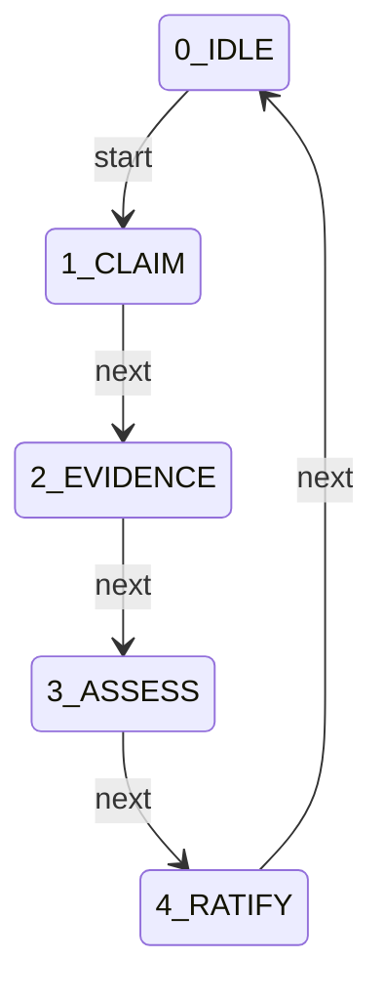

## 🚦 State Definitions

### 0_IDLE
#### ➡️ Transitions
| Trigger | Target State | 🛡️ Gated By |
|:---|:---|:---|
| `start` | **1_CLAIM** | *(None)* |

---
### 1_CLAIM
*Submission of Engineer Claims*

#### 📋 Requirements
| ID | Type | Target | Details |
|:---|:---|:---|:---|
| **engineer_report** | `file_exists` | - |  |

#### ➡️ Transitions
| Trigger | Target State | 🛡️ Gated By |
|:---|:---|:---|
| `next` | **2_EVIDENCE** | *(None)* |

---
### 2_EVIDENCE
*Warden Evidence Generation*

#### 📋 Requirements
| ID | Type | Target | Details |
|:---|:---|:---|:---|
| **compliance_assessment** | `command_log` | - | Pattern: `node engine/report.js --compliance` |

#### ➡️ Transitions
| Trigger | Target State | 🛡️ Gated By |
|:---|:---|:---|
| `next` | **3_ASSESS** | *(None)* |

---
### 3_ASSESS
*Verification of Delta*

#### 📋 Requirements
| ID | Type | Target | Details |
|:---|:---|:---|:---|
| **compliance_assessment_token** | `regex_match_output` | - | Pattern: `DLR_ASM_COMPLIANCE` |
| **engineer_analysis** | `regex_match_output` | - | Pattern: `DLR_AUD_COMPLIANCE` |

#### ➡️ Transitions
| Trigger | Target State | 🛡️ Gated By |
|:---|:---|:---|
| `next` | **4_RATIFY** | *(None)* |

---
### 4_RATIFY
*Director Final Approval*

#### 📋 Requirements
| ID | Type | Target | Details |
|:---|:---|:---|:---|
| **director_compliance_ack** | `regex_match_output` | - | Pattern: `DLR_CMP_ACK|Approved|Ratified` |

#### ➡️ Transitions
| Trigger | Target State | 🛡️ Gated By |
|:---|:---|:---|
| `next` | **0_IDLE** | *(None)* |

---

---

# Protocol: CFG_V2

**Title:** Configuration Injection v2  
**Version:** 2.0.0  

> Immutable Base, Dynamic Overlay.

### 📜 Principles
- Adherence to STD_COGNITIVE_FIDELITY: Velocity must never outpace Understanding.

## 📊 Lifecycle Flowchart

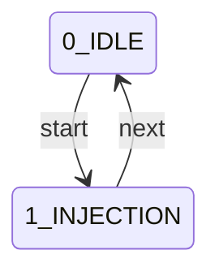

## 🚦 State Definitions

### 0_IDLE
#### ➡️ Transitions
| Trigger | Target State | 🛡️ Gated By |
|:---|:---|:---|
| `start` | **1_INJECTION** | *(None)* |

---
### 1_INJECTION
*Injector Check*

#### 📋 Requirements
| ID | Type | Target | Details |
|:---|:---|:---|:---|
| **config_resolve** | `command_log` | - | Pattern: `node engine/main.js` |

#### ➡️ Transitions
| Trigger | Target State | 🛡️ Gated By |
|:---|:---|:---|
| `next` | **0_IDLE** | *(None)* |

---

---

# Protocol: DOC_V2

**Title:** Automated Documentation Standard v2 (Aligned)  
**Version:** 2.1.0  

> Documentation as Code: Single Source of Truth.

### 📜 Principles
- Adherence to STD_COGNITIVE_FIDELITY: Velocity must never outpace Understanding.

## 📊 Lifecycle Flowchart

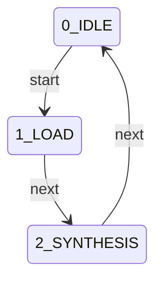

## 🚦 State Definitions

### 0_IDLE
#### ➡️ Transitions
| Trigger | Target State | 🛡️ Gated By |
|:---|:---|:---|
| `start` | **1_LOAD** | *(None)* |

---
### 1_LOAD
*Source Verification*

#### 📋 Requirements
| ID | Type | Target | Details |
|:---|:---|:---|:---|
| **json_sources** | `file_exists` | - |  |

#### ➡️ Transitions
| Trigger | Target State | 🛡️ Gated By |
|:---|:---|:---|
| `next` | **2_SYNTHESIS** | *(None)* |

---
### 2_SYNTHESIS
*Markdown Generation*

#### 📋 Requirements
| ID | Type | Target | Details |
|:---|:---|:---|:---|
| **readme_file** | `regex_match_output` | - | Pattern: `DLR_DOC_README` |
| **protocols_file** | `regex_match_output` | - | Pattern: `DLR_DOC_PROTOCOLS` |

#### ➡️ Transitions
| Trigger | Target State | 🛡️ Gated By |
|:---|:---|:---|
| `next` | **0_IDLE** | *(None)* |

---

---

# Protocol: ENV_V2

**Title:** Environment & Resource Standard v2  
**Version:** 2.0.0  

> Stability is Physical: Logic requires a verified environment.

### 🧠 Philosophy
> Logic requires a verified environment to execute with fidelity.

### 📜 Principles
- Adherence to STD_COGNITIVE_FIDELITY: Velocity must never outpace Understanding.

## 📊 Lifecycle Flowchart

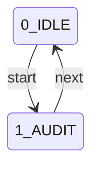

## 🚦 State Definitions

### 0_IDLE
#### ➡️ Transitions
| Trigger | Target State | 🛡️ Gated By |
|:---|:---|:---|
| `start` | **1_AUDIT** | *(None)* |

---
### 1_AUDIT
*Resource Check*

#### 📋 Requirements
| ID | Type | Target | Details |
|:---|:---|:---|:---|
| **env_manifest** | `regex_match_output` | - | Pattern: `\[DLR_MAN_ENV\].*` |

#### ➡️ Transitions
| Trigger | Target State | 🛡️ Gated By |
|:---|:---|:---|
| `next` | **0_IDLE** | *(None)* |

---

---

# Protocol: EVO_V2

**Title:** Protocol Evolution & Amendment v2  
**Version:** 2.0.0  

> Self-Optimizing Governance: Friction-Driven Evolution.

### 📜 Principles
- Adherence to STD_COGNITIVE_FIDELITY: Velocity must never outpace Understanding.

## 📊 Lifecycle Flowchart

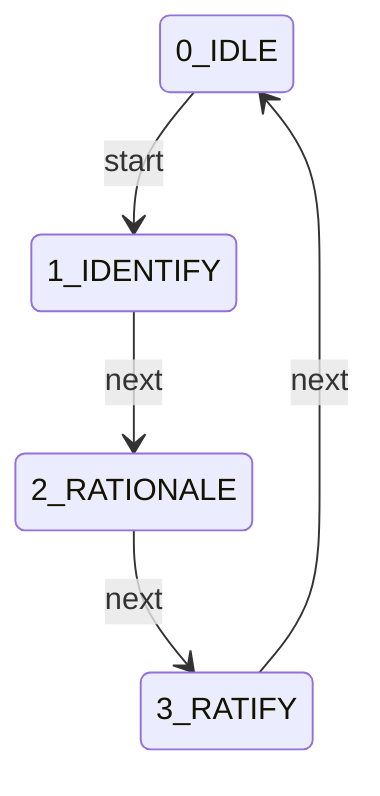

## 🚦 State Definitions

### 0_IDLE
#### ➡️ Transitions
| Trigger | Target State | 🛡️ Gated By |
|:---|:---|:---|
| `start` | **1_IDENTIFY** | *(None)* |

---
### 1_IDENTIFY
*Friction Detection*

#### ➡️ Transitions
| Trigger | Target State | 🛡️ Gated By |
|:---|:---|:---|
| `next` | **2_RATIONALE** | *(None)* |

---
### 2_RATIONALE
*Justification*

#### 📋 Requirements
| ID | Type | Target | Details |
|:---|:---|:---|:---|
| **friction_analysis** | `regex_match_output` | - | Pattern: `RATIONALE` |

#### ➡️ Transitions
| Trigger | Target State | 🛡️ Gated By |
|:---|:---|:---|
| `next` | **3_RATIFY** | *(None)* |

---
### 3_RATIFY
*Director Approval*

#### ➡️ Transitions
| Trigger | Target State | 🛡️ Gated By |
|:---|:---|:---|
| `next` | **0_IDLE** | *(None)* |

---

---

# Protocol: FIX_V2

**Title:** Emergency Recovery Standard v2  
**Version:** 2.0.0  

> Urgency is no Excuse for Instability.

### 📜 Principles
- Adherence to STD_COGNITIVE_FIDELITY: Velocity must never outpace Understanding.

## 📊 Lifecycle Flowchart

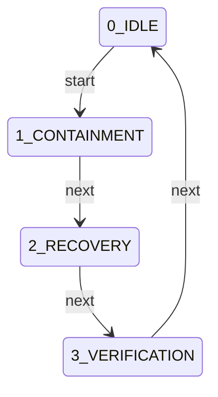

## 🚦 State Definitions

### 0_IDLE
#### ➡️ Transitions
| Trigger | Target State | 🛡️ Gated By |
|:---|:---|:---|
| `start` | **1_CONTAINMENT** | *(None)* |

---
### 1_CONTAINMENT
*Failure Analysis*

#### 📋 Requirements
| ID | Type | Target | Details |
|:---|:---|:---|:---|
| **fix_trace** | `regex_match_output` | - | Pattern: `\[DLR_TRC_ERROR\].*` |

#### ➡️ Transitions
| Trigger | Target State | 🛡️ Gated By |
|:---|:---|:---|
| `next` | **2_RECOVERY** | *(None)* |

---
### 2_RECOVERY
*Targeted Repair*

#### 📋 Requirements
| ID | Type | Target | Details |
|:---|:---|:---|:---|
| **fix_patch** | `regex_match_output` | - | Pattern: `\[DLR_PTC_RECOVERY\].*` |

#### ➡️ Transitions
| Trigger | Target State | 🛡️ Gated By |
|:---|:---|:---|
| `next` | **3_VERIFICATION** | *(None)* |

---
### 3_VERIFICATION
*Fidelity Check*

#### 📋 Requirements
| ID | Type | Target | Details |
|:---|:---|:---|:---|
| **vfy_audit** | `command_log` | - | Pattern: `node validation/verify_integrity.js --verify` |

#### ➡️ Transitions
| Trigger | Target State | 🛡️ Gated By |
|:---|:---|:---|
| `next` | **0_IDLE** | *(None)* |

---

---

# Protocol: GSD_V5

**Title:** Gated Sequential Development v5 (Closed-Loop)  
**Version:** 5.9.0  

> SQA-anchored development lifecycle with mandatory artifact audit and compliance gates.

### 🧠 Philosophy
> Integrity over Velocity: Implementation requires active verification.

### 📜 Principles
- Adherence to STD_COGNITIVE_FIDELITY: Velocity must never outpace Understanding.
- All logic changes must produce a recoverable patch file.
- Every objective must be anchored to a System Quality Attribute.
- Atomic Turn Enforcement: No phase transitions in the turn of delivery.
- PIR must provide a weighted evidence table mapping to SQAs.
- Hardened Gate Enforcement: All transitions require explicit evidence validation.
- Qualitative Alignment: Mission Briefing is mandatory before Planning.
- Active Analysis: All generated deliverables must be read and audited.
- Tiered Persistence: Maintain core DNA while purging ephemeral history.
- Closed-Loop Compliance: Automated reporting verifies fidelity against Goals and Standards.

### 👥 Roles & Responsibilities
#### Engineer (Lead Analyst & Implementer)
- Technical logic architecture and implementation.
- Mapping objectives to System Quality Attributes and Standards.
- Generation of local-scoped, reversible patches.
- Active audit and analysis of all generated artifacts.
- Maintenance of automated documentation scripts.

#### Director (System Arbiter & Mission Lead)
- Defining project vision and success criteria.
- Validation of SQA-anchored planning.
- Final approval of impact assessments.
- Review of Artifact Audits and Compliance Reports.

## 📊 Lifecycle Flowchart

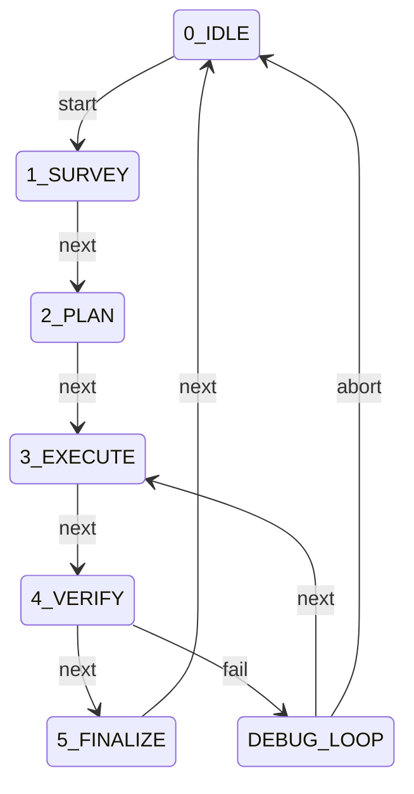

## 🚦 State Definitions

### 0_IDLE
#### ➡️ Transitions
| Trigger | Target State | 🛡️ Gated By |
|:---|:---|:---|
| `start` | **1_SURVEY** | *(None)* |

---
### 1_SURVEY
*Context Gathering & Baseline*

#### 📋 Requirements
| ID | Type | Target | Details |
|:---|:---|:---|:---|
| **knowledge_pulse** | `command_log` | - | Pattern: `node engine/onboard.js --refresh` |
| **mission_brief** | `regex_match_output` | - | Pattern: `DLR_BRF_MISSION` |
| **director_ack_survey** | `regex_match_output` | - | Pattern: `DLR_SUR_ACK|Approved|Ratified` |

#### ➡️ Transitions
| Trigger | Target State | 🛡️ Gated By |
|:---|:---|:---|
| `next` | **2_PLAN** | `knowledge_pulse`, `mission_brief`, `director_ack_survey` |

---
### 2_PLAN
*Strategic Proposal & Feature Specification*

#### 📋 Requirements
| ID | Type | Target | Details |
|:---|:---|:---|:---|
| **feature_spec** | `file_exists` | - |  |
| **sqa_anchoring** | `regex_match_output` | - | Pattern: `DLR_PLN_GSD.*(SQA Anchors|Impact)` |
| **director_approval** | `regex_match_output` | - | Pattern: `DLR_PLN_ACK|Approved|Ratified` |

#### ➡️ Transitions
| Trigger | Target State | 🛡️ Gated By |
|:---|:---|:---|
| `next` | **3_EXECUTE** | `feature_spec`, `sqa_anchoring`, `director_approval` |

---
### 3_EXECUTE
*Implementation & Audit*

#### 📋 Requirements
| ID | Type | Target | Details |
|:---|:---|:---|:---|
| **patch_file** | `file_exists` | - | Freshness Check |
| **artifact_audit** | `regex_match_output` | - | Pattern: `DLR_AUD_ARTIFACT` |

#### ➡️ Transitions
| Trigger | Target State | 🛡️ Gated By |
|:---|:---|:---|
| `next` | **4_VERIFY** | `patch_file`, `artifact_audit` |

---
### 4_VERIFY
*Validation*

#### 📋 Requirements
| ID | Type | Target | Details |
|:---|:---|:---|:---|
| **director_verification_ack** | `regex_match_output` | - | Pattern: `DLR_VFY_ACK|Approved|Ratified` |

#### ➡️ Transitions
| Trigger | Target State | 🛡️ Gated By |
|:---|:---|:---|
| `next` | **5_FINALIZE** | `director_verification_ack` |
| `fail` | **DEBUG_LOOP** | *(None)* |

---
### DEBUG_LOOP
*Logic Failure Containment*

#### 📋 Requirements
| ID | Type | Target | Details |
|:---|:---|:---|:---|
| **failure_analysis** | `regex_match_output` | - | Pattern: `DEBUG_LOG` |

#### ➡️ Transitions
| Trigger | Target State | 🛡️ Gated By |
|:---|:---|:---|
| `next` | **3_EXECUTE** | `failure_analysis` |
| `abort` | **0_IDLE** | *(None)* |

---
### 5_FINALIZE
*Closure*

#### 📋 Requirements
| ID | Type | Target | Details |
|:---|:---|:---|:---|
| **finalizer** | `command_log` | - | Pattern: `node docs/finalizer.js` |

#### ➡️ Transitions
| Trigger | Target State | 🛡️ Gated By |
|:---|:---|:---|
| `next` | **0_IDLE** | `finalizer` |

---

---

# Protocol: IDEA_V1

**Title:** Idea Management Protocol v1  
**Version:** 1.1.0  

> Lifecycle management for raw ideas: Capture -> Incubate -> Germinate.

### 📜 Principles
- Adherence to STD_COGNITIVE_FIDELITY: Velocity must never outpace Understanding.

## 📊 Lifecycle Flowchart

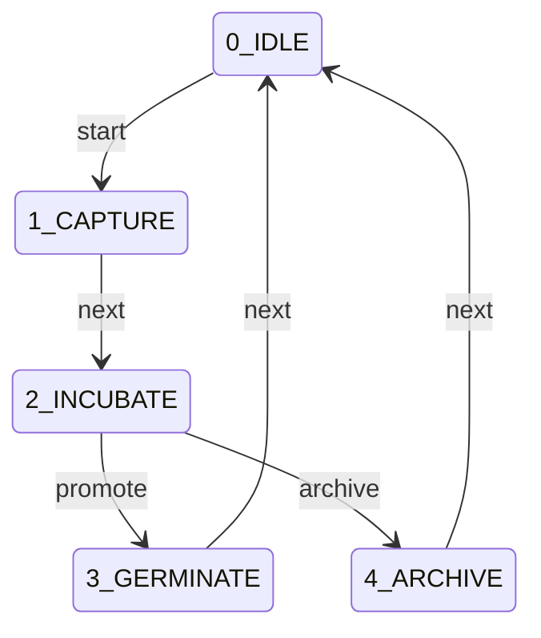

## 🚦 State Definitions

### 0_IDLE
#### ➡️ Transitions
| Trigger | Target State | 🛡️ Gated By |
|:---|:---|:---|
| `start` | **1_CAPTURE** | *(None)* |

---
### 1_CAPTURE
*Idea Recording*

#### 📋 Requirements
| ID | Type | Target | Details |
|:---|:---|:---|:---|
| **idea_file** | `file_exists` | - |  |

#### ➡️ Transitions
| Trigger | Target State | 🛡️ Gated By |
|:---|:---|:---|
| `next` | **2_INCUBATE** | *(None)* |

---
### 2_INCUBATE
*Gated Refinement Dialogue*

#### 📋 Requirements
| ID | Type | Target | Details |
|:---|:---|:---|:---|
| **dialogue_log** | `command_log` | - | Pattern: `node engine/idea.js --refine` |
| **concept_artifact** | `file_exists` | - |  |
| **director_ratification** | `regex_match_output` | - | Pattern: `DLR_IDE_ACK|Approved|Ratified` |

#### ➡️ Transitions
| Trigger | Target State | 🛡️ Gated By |
|:---|:---|:---|
| `promote` | **3_GERMINATE** | *(None)* |
| `archive` | **4_ARCHIVE** | *(None)* |

---
### 3_GERMINATE
*Promotion to Strategy*

#### ➡️ Transitions
| Trigger | Target State | 🛡️ Gated By |
|:---|:---|:---|
| `next` | **0_IDLE** | *(None)* |

---
### 4_ARCHIVE
*Historical Record*

#### ➡️ Transitions
| Trigger | Target State | 🛡️ Gated By |
|:---|:---|:---|
| `next` | **0_IDLE** | *(None)* |

---

---

# Protocol: MAP_V2

**Title:** System Mapping & Contextualization v2  
**Version:** 2.0.0  

> Context precedes Logic: An entity cannot modify what it does not map.

### 📜 Principles
- Adherence to STD_COGNITIVE_FIDELITY: Velocity must never outpace Understanding.

## 📊 Lifecycle Flowchart

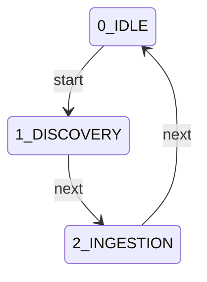

## 🚦 State Definitions

### 0_IDLE
#### ➡️ Transitions
| Trigger | Target State | 🛡️ Gated By |
|:---|:---|:---|
| `start` | **1_DISCOVERY** | *(None)* |

---
### 1_DISCOVERY
*Locate Manifest*

#### 📋 Requirements
| ID | Type | Target | Details |
|:---|:---|:---|:---|
| **metadata_file** | `file_exists` | - |  |

#### ➡️ Transitions
| Trigger | Target State | 🛡️ Gated By |
|:---|:---|:---|
| `next` | **2_INGESTION** | *(None)* |

---
### 2_INGESTION
*Contextual Echo*

#### 📋 Requirements
| ID | Type | Target | Details |
|:---|:---|:---|:---|
| **structural_mapping** | `regex_match_output` | - | Pattern: `\[DLR_MAP_STRUCT\].*` |

#### ➡️ Transitions
| Trigger | Target State | 🛡️ Gated By |
|:---|:---|:---|
| `next` | **0_IDLE** | *(None)* |

---

---

# Protocol: ONBOARD_V4

**Title:** System Onboarding & Philosophy v4  
**Version:** 4.1.0  

> Initial alignment and role assumption.

### 🧠 Philosophy
> Collaborative Stewardship: Aligning Director vision with Engineer execution from Turn 1.

### 📜 Principles
- Adherence to STD_COGNITIVE_FIDELITY: Velocity must never outpace Understanding.
- Director owns Objective & Decision; Engineer owns Execution & Verification.
- Integrity of the codebase is maintained through strict protocol adherence.
- Transparency is achieved through mandatory initial response echoes.

### 👥 Roles & Responsibilities
#### Engineer (Lead Analyst & Implementer)
- Context gathering and technical analysis.
- Transactional implementation and verification.
- Maintaining bit-perfect audit fidelity.

#### Director (System Arbiter & Mission Lead)
- Strategic intent definition and mission briefing.
- Gate authorization and plan approval.
- Final compliance ratification and seal.

#### Oracle (System Mentor & Knowledge Authority)
- Providing semantic and structural guidance.
- Interactive induction and module-based learning.
- Clarifying system standards and protocol logic.

## 📊 Lifecycle Flowchart

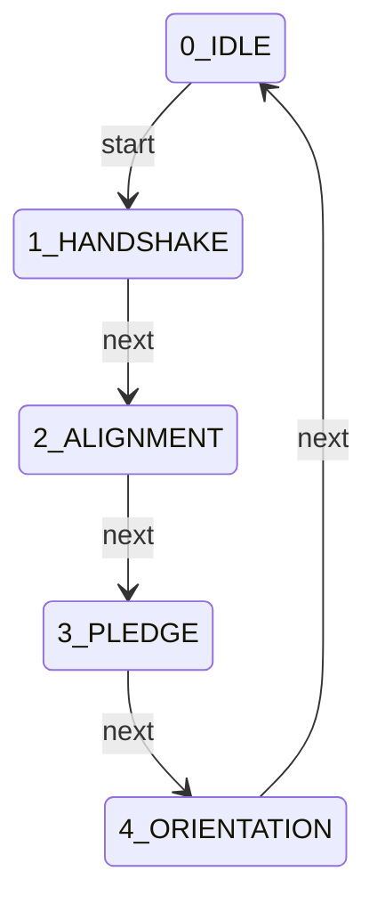

## 🚦 State Definitions

### 0_IDLE
#### ➡️ Transitions
| Trigger | Target State | 🛡️ Gated By |
|:---|:---|:---|
| `start` | **1_HANDSHAKE** | *(None)* |

---
### 1_HANDSHAKE
*Protocol Handshake*

#### 📋 Requirements
| ID | Type | Target | Details |
|:---|:---|:---|:---|
| **onboard_tool** | `command_log` | - | Pattern: `node engine/onboard.js` |
| **echo_dlr_headers** | `regex_match_output` | - | Pattern: `\[DLR_HND_ONBOARD\].*(Principles Echo|Role Acceptance|Registry Mapping|Domain Awareness)` |

#### ➡️ Transitions
| Trigger | Target State | 🛡️ Gated By |
|:---|:---|:---|
| `next` | **2_ALIGNMENT** | *(None)* |

---
### 2_ALIGNMENT
*ZK Fidelity Alignment*

#### 📋 Requirements
| ID | Type | Target | Details |
|:---|:---|:---|:---|
| **alignment_success** | `regex_match_output` | - | Pattern: `ZK FIDELITY ALIGNED` |

#### ➡️ Transitions
| Trigger | Target State | 🛡️ Gated By |
|:---|:---|:---|
| `next` | **3_PLEDGE** | *(None)* |

---
### 3_PLEDGE
*Behavioral Pledge*

#### 📋 Requirements
| ID | Type | Target | Details |
|:---|:---|:---|:---|
| **behavioral_pledge_cert** | `file_exists` | - |  |
| **quiz_success** | `regex_match_output` | - | Pattern: `VERIFICATION SUCCESSFUL` |

#### ➡️ Transitions
| Trigger | Target State | 🛡️ Gated By |
|:---|:---|:---|
| `next` | **4_ORIENTATION** | *(None)* |

---
### 4_ORIENTATION
*Project Orientation*

#### 📋 Requirements
| ID | Type | Target | Details |
|:---|:---|:---|:---|
| **project_orientation_tool** | `command_log` | - | Pattern: `node engine/onboard.js --project` |
| **orientation_complete** | `regex_match_output` | - | Pattern: `Orientation Complete` |

#### ➡️ Transitions
| Trigger | Target State | 🛡️ Gated By |
|:---|:---|:---|
| `next` | **0_IDLE** | *(None)* |

---

---

# Protocol: OPTIMISE_V2

**Title:** Structural Evolution & Refactoring v2  
**Version:** 2.0.0  

> Friction-to-Flow: Structural improvement without regression.

### 📜 Principles
- Adherence to STD_COGNITIVE_FIDELITY: Velocity must never outpace Understanding.

## 📊 Lifecycle Flowchart

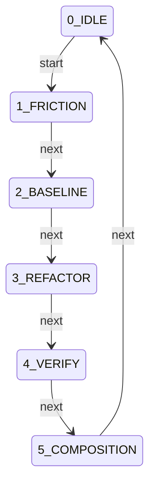

## 🚦 State Definitions

### 0_IDLE
#### ➡️ Transitions
| Trigger | Target State | 🛡️ Gated By |
|:---|:---|:---|
| `start` | **1_FRICTION** | *(None)* |

---
### 1_FRICTION
*Detection*

#### ➡️ Transitions
| Trigger | Target State | 🛡️ Gated By |
|:---|:---|:---|
| `next` | **2_BASELINE** | *(None)* |

---
### 2_BASELINE
*Guardrail*

#### 📋 Requirements
| ID | Type | Target | Details |
|:---|:---|:---|:---|
| **performance_ceiling** | `command_log` | - | Pattern: `VAL_V2` |

#### ➡️ Transitions
| Trigger | Target State | 🛡️ Gated By |
|:---|:---|:---|
| `next` | **3_REFACTOR** | *(None)* |

---
### 3_REFACTOR
*Execution*

#### 📋 Requirements
| ID | Type | Target | Details |
|:---|:---|:---|:---|
| **gsd_cycle** | `command_log` | - | Pattern: `GSD_V4` |

#### ➡️ Transitions
| Trigger | Target State | 🛡️ Gated By |
|:---|:---|:---|
| `next` | **4_VERIFY** | *(None)* |

---
### 4_VERIFY
*Regression Check*

#### ➡️ Transitions
| Trigger | Target State | 🛡️ Gated By |
|:---|:---|:---|
| `next` | **5_COMPOSITION** | *(None)* |

---
### 5_COMPOSITION
*History Update*

#### 📋 Requirements
| ID | Type | Target | Details |
|:---|:---|:---|:---|
| **matrix_update** | `command_log` | - | Pattern: `node utils/update_matrix.js` |

#### ➡️ Transitions
| Trigger | Target State | 🛡️ Gated By |
|:---|:---|:---|
| `next` | **0_IDLE** | *(None)* |

---

---

# Protocol: PIR_V4

**Title:** Post-Implementation Review Standard v4 (Interaction Report)  
**Version:** 4.2.0  

> Actionable post-mortem and knowledge persistence engine.

### 📜 Principles
- Adherence to STD_COGNITIVE_FIDELITY: Velocity must never outpace Understanding.

## 📊 Lifecycle Flowchart

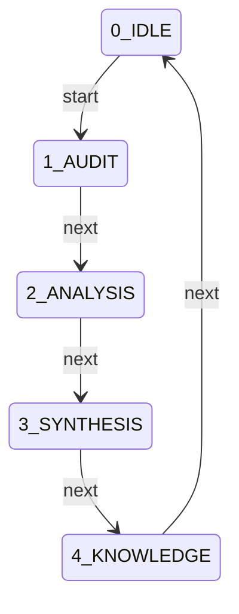

## 🚦 State Definitions

### 0_IDLE
#### ➡️ Transitions
| Trigger | Target State | 🛡️ Gated By |
|:---|:---|:---|
| `start` | **1_AUDIT** | *(None)* |

---
### 1_AUDIT
*Context Collection*

#### 📋 Requirements
| ID | Type | Target | Details |
|:---|:---|:---|:---|
| **fidelity_status** | `regex_match_output` | - | Pattern: `STABLE` |

#### ➡️ Transitions
| Trigger | Target State | 🛡️ Gated By |
|:---|:---|:---|
| `next` | **2_ANALYSIS** | *(None)* |

---
### 2_ANALYSIS
*Root Cause Analysis*

#### 📋 Requirements
| ID | Type | Target | Details |
|:---|:---|:---|:---|
| **interaction_report** | `regex_match_output` | - | Pattern: `DLR_RPT_INTERACTION` |
| **anomaly_analysis** | `regex_match_output` | - | Pattern: `Anomaly Analysis` |

#### ➡️ Transitions
| Trigger | Target State | 🛡️ Gated By |
|:---|:---|:---|
| `next` | **3_SYNTHESIS** | *(None)* |

---
### 3_SYNTHESIS
*Remediation Strategy*

#### 📋 Requirements
| ID | Type | Target | Details |
|:---|:---|:---|:---|
| **remediation_table** | `regex_match_output` | - | Pattern: `Remediation Table` |

#### ➡️ Transitions
| Trigger | Target State | 🛡️ Gated By |
|:---|:---|:---|
| `next` | **4_KNOWLEDGE** | *(None)* |

---
### 4_KNOWLEDGE
*Persistence*

#### 📋 Requirements
| ID | Type | Target | Details |
|:---|:---|:---|:---|
| **knowledge_injection** | `file_freshness` | registry/knowledge_base.json |  |
| **knowledge_entry_echo** | `regex_match_output` | - | Pattern: `DLR_KNO_ENTRY` |

#### ➡️ Transitions
| Trigger | Target State | 🛡️ Gated By |
|:---|:---|:---|
| `next` | **0_IDLE** | *(None)* |

---

---

# Protocol: PRY_V2

**Title:** Engineer Proficiency Standard v2  
**Version:** 2.1.0  

> Competence is Demonstrated, not Declared.

### 📜 Principles
- Adherence to STD_COGNITIVE_FIDELITY: Velocity must never outpace Understanding.

## 📊 Lifecycle Flowchart

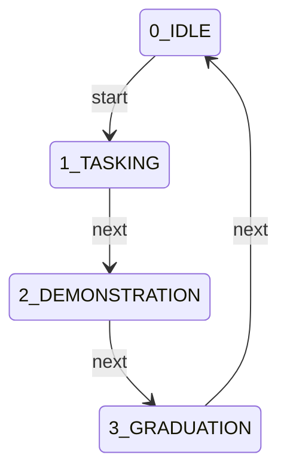

## 🚦 State Definitions

### 0_IDLE
#### ➡️ Transitions
| Trigger | Target State | 🛡️ Gated By |
|:---|:---|:---|
| `start` | **1_TASKING** | *(None)* |

---
### 1_TASKING
*Task Definition*

#### ➡️ Transitions
| Trigger | Target State | 🛡️ Gated By |
|:---|:---|:---|
| `next` | **2_DEMONSTRATION** | *(None)* |

---
### 2_DEMONSTRATION
*Procedural Execution*

#### 📋 Requirements
| ID | Type | Target | Details |
|:---|:---|:---|:---|
| **gsd_cycle** | `command_log` | - | Pattern: `./warden close` |

#### ➡️ Transitions
| Trigger | Target State | 🛡️ Gated By |
|:---|:---|:---|
| `next` | **3_GRADUATION** | *(None)* |

---
### 3_GRADUATION
*Certification*

#### 📋 Requirements
| ID | Type | Target | Details |
|:---|:---|:---|:---|
| **pry_cert** | `regex_match_output` | - | Pattern: `\[DLR_CRT_PROFICIENCY\].*` |

#### ➡️ Transitions
| Trigger | Target State | 🛡️ Gated By |
|:---|:---|:---|
| `next` | **0_IDLE** | *(None)* |

---

---

# Protocol: ROADMAP_V2

**Title:** Strategic Roadmap Evolution v2  
**Version:** 2.0.0  

> Intentional Evolution: Strategic planning.

### 📜 Principles
- Adherence to STD_COGNITIVE_FIDELITY: Velocity must never outpace Understanding.

## 📊 Lifecycle Flowchart

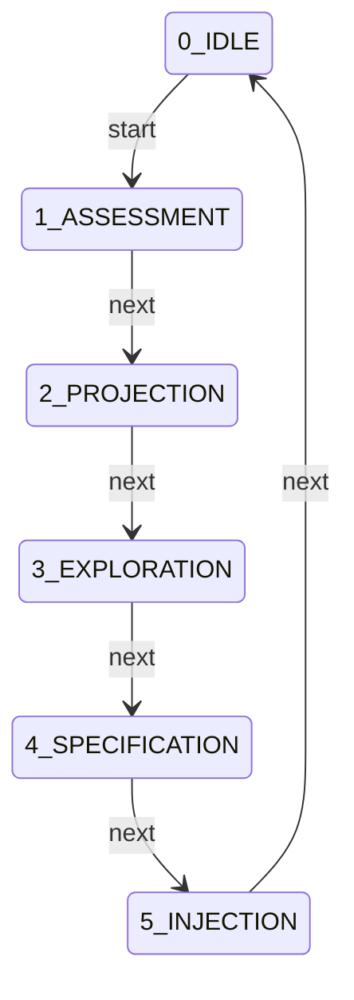

## 🚦 State Definitions

### 0_IDLE
#### ➡️ Transitions
| Trigger | Target State | 🛡️ Gated By |
|:---|:---|:---|
| `start` | **1_ASSESSMENT** | *(None)* |

---
### 1_ASSESSMENT
*State Review*

#### ➡️ Transitions
| Trigger | Target State | 🛡️ Gated By |
|:---|:---|:---|
| `next` | **2_PROJECTION** | *(None)* |

---
### 2_PROJECTION
*Future Mapping*

#### ➡️ Transitions
| Trigger | Target State | 🛡️ Gated By |
|:---|:---|:---|
| `next` | **3_EXPLORATION** | *(None)* |

---
### 3_EXPLORATION
*Brainstorming*

#### ➡️ Transitions
| Trigger | Target State | 🛡️ Gated By |
|:---|:---|:---|
| `next` | **4_SPECIFICATION** | *(None)* |

---
### 4_SPECIFICATION
*Feature Definition*

#### ➡️ Transitions
| Trigger | Target State | 🛡️ Gated By |
|:---|:---|:---|
| `next` | **5_INJECTION** | *(None)* |

---
### 5_INJECTION
*Finalization*

#### 📋 Requirements
| ID | Type | Target | Details |
|:---|:---|:---|:---|
| **roadmap_update** | `file_exists` | - |  |

#### ➡️ Transitions
| Trigger | Target State | 🛡️ Gated By |
|:---|:---|:---|
| `next` | **0_IDLE** | *(None)* |

---

---

# Protocol: STAT_V2

**Title:** Automated Status Reporting v2  
**Version:** 2.0.0  

> System Pulse: Real-time visibility into health and debt.

### 📜 Principles
- Adherence to STD_COGNITIVE_FIDELITY: Velocity must never outpace Understanding.

## 📊 Lifecycle Flowchart

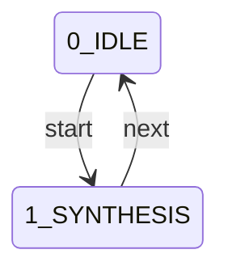

## 🚦 State Definitions

### 0_IDLE
#### ➡️ Transitions
| Trigger | Target State | 🛡️ Gated By |
|:---|:---|:---|
| `start` | **1_SYNTHESIS** | *(None)* |

---
### 1_SYNTHESIS
*Data Aggregation*

#### 📋 Requirements
| ID | Type | Target | Details |
|:---|:---|:---|:---|
| **status_tool** | `command_log` | - | Pattern: `node docs/generate_status.js` |
| **status_artifact** | `regex_match_output` | - | Pattern: `\[DLR_MAN_STATUS\].*` |

#### ➡️ Transitions
| Trigger | Target State | 🛡️ Gated By |
|:---|:---|:---|
| `next` | **0_IDLE** | *(None)* |

---

---

# Protocol: VAL_V2

**Title:** Concurrency Validation v2  
**Version:** 2.0.0  

> Heisenbug Hunting: Stability requires iterative verification.

### 📜 Principles
- Adherence to STD_COGNITIVE_FIDELITY: Velocity must never outpace Understanding.

## 📊 Lifecycle Flowchart

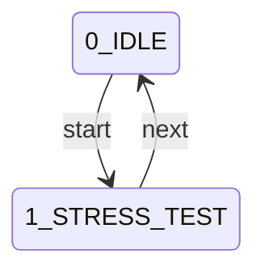

## 🚦 State Definitions

### 0_IDLE
#### ➡️ Transitions
| Trigger | Target State | 🛡️ Gated By |
|:---|:---|:---|
| `start` | **1_STRESS_TEST** | *(None)* |

---
### 1_STRESS_TEST
*Sequential Run*

#### 📋 Requirements
| ID | Type | Target | Details |
|:---|:---|:---|:---|
| **iteration_log** | `regex_match_output` | - | Pattern: `100% hash parity` |

#### ➡️ Transitions
| Trigger | Target State | 🛡️ Gated By |
|:---|:---|:---|
| `next` | **0_IDLE** | *(None)* |

---

---

# Protocol: VFY_V2

**Title:** Protocol Integrity & Artifact Audit v2  
**Version:** 2.2.0  

> Automated governance fidelity and proactive artifact analysis.

### 🧠 Philosophy
> Trust but Verify: Governance is only as strong as its active audit trail.

### 📜 Principles
- Adherence to STD_COGNITIVE_FIDELITY: Velocity must never outpace Understanding.

## 📊 Lifecycle Flowchart

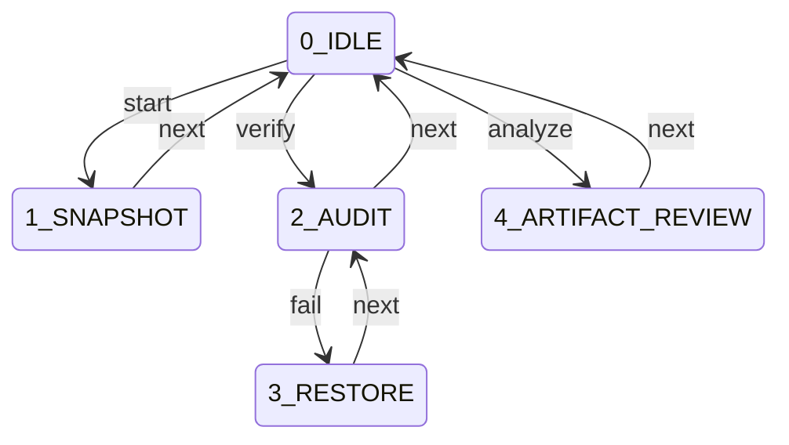

## 🚦 State Definitions

### 0_IDLE
#### ➡️ Transitions
| Trigger | Target State | 🛡️ Gated By |
|:---|:---|:---|
| `start` | **1_SNAPSHOT** | *(None)* |
| `verify` | **2_AUDIT** | *(None)* |
| `analyze` | **4_ARTIFACT_REVIEW** | *(None)* |

---
### 1_SNAPSHOT
*Baseline Creation*

#### 📋 Requirements
| ID | Type | Target | Details |
|:---|:---|:---|:---|
| **snapshot_tool** | `command_log` | - | Pattern: `node validation/verify_integrity.js --snapshot` |

#### ➡️ Transitions
| Trigger | Target State | 🛡️ Gated By |
|:---|:---|:---|
| `next` | **0_IDLE** | `snapshot_tool` |

---
### 2_AUDIT
*Fidelity Verification*

#### 📋 Requirements
| ID | Type | Target | Details |
|:---|:---|:---|:---|
| **verify_tool** | `command_log` | - | Pattern: `node validation/verify_integrity.js --verify` |

#### ➡️ Transitions
| Trigger | Target State | 🛡️ Gated By |
|:---|:---|:---|
| `next` | **0_IDLE** | `verify_tool` |
| `fail` | **3_RESTORE** | *(None)* |

---
### 3_RESTORE
*Integrity Restoration*

#### 📋 Requirements
| ID | Type | Target | Details |
|:---|:---|:---|:---|
| **restore_tool** | `command_log` | - | Pattern: `node validation/verify_integrity.js --restore` |

#### ➡️ Transitions
| Trigger | Target State | 🛡️ Gated By |
|:---|:---|:---|
| `next` | **2_AUDIT** | `restore_tool` |

---
### 4_ARTIFACT_REVIEW
*Active Output Analysis*

#### 📋 Requirements
| ID | Type | Target | Details |
|:---|:---|:---|:---|
| **artifact_read** | `command_log` | - | Pattern: `cat|read_file` |
| **artifact_audit** | `regex_match_output` | - | Pattern: `DLR_AUD_ARTIFACT` |

#### ➡️ Transitions
| Trigger | Target State | 🛡️ Gated By |
|:---|:---|:---|
| `next` | **0_IDLE** | *(None)* |

---

---

